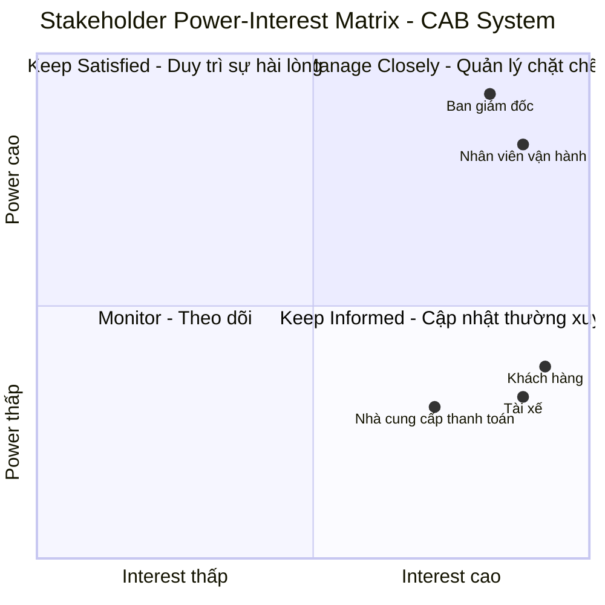

# B1. ĐỌC VÀ PHÂN TÍCH YÊU CẦU SƠ KHỞI CỦA KHÁCH HÀNG Ở GIAI ĐOẠN 1

## 1. Tổng quan yêu cầu

Dựa trên tài liệu **“Yêu cầu của khách hàng – Dự án xây dựng hệ thống CAB System – Nền tảng đặt xe”**, Công ty ABC hiện đang cung cấp dịch vụ đặt xe trực tuyến thông qua tổng đài và một ứng dụng đơn giản. Tuy nhiên, hệ thống hiện tại còn tồn tại nhiều hạn chế như việc phân công tài xế chủ yếu được thực hiện thủ công, khách hàng khó theo dõi trạng thái chuyến đi, thông tin thanh toán chưa được quản lý tập trung và hệ thống gặp khó khăn trong việc mở rộng khi số lượng khách hàng và tài xế tăng lên.

Vì vậy, khách hàng mong muốn xây dựng một **nền tảng CAB System mới**, không chỉ đáp ứng nhu cầu đặt xe hiện tại mà còn có khả năng phục vụ số lượng lớn người dùng và hỗ trợ mở rộng thêm các tính năng trong tương lai. Thời gian dự kiến xây dựng và triển khai sản phẩm là **7 tuần**.

## 2. Xác định các tác nhân chính

Qua phân tích yêu cầu sơ khởi, hệ thống có ba nhóm tác nhân chính:

### 2.1. Khách hàng

Khách hàng là người sử dụng dịch vụ đặt xe. Các nhu cầu chính gồm:

* Đăng ký và đăng nhập tài khoản.
* Cập nhật thông tin cá nhân.
* Nhập điểm đón và điểm đến.
* Lựa chọn loại xe.
* Gửi yêu cầu đặt xe.
* Theo dõi trạng thái yêu cầu và chuyến đi.
* Biết tài xế nào đã nhận chuyến và thời gian dự kiến tài xế đến.
* Xem lịch sử chuyến đi và số tiền phải trả.
* Đánh giá tài xế sau khi chuyến đi hoàn thành.

### 2.2. Tài xế

Tài xế là tác nhân trực tiếp thực hiện chuyến xe. Hệ thống cần hỗ trợ:

* Đăng ký tài khoản hoặc được nhân viên vận hành tạo tài khoản.
* Cập nhật hồ sơ và thông tin phương tiện.
* Cập nhật trạng thái hoạt động.
* Chuyển sang trạng thái sẵn sàng nhận chuyến.
* Nhận thông báo khi có chuyến phù hợp.
* Chấp nhận hoặc từ chối chuyến.
* Cập nhật trạng thái chuyến đi.
* Cung cấp thông tin vị trí để hỗ trợ việc tìm tài xế và dự kiến thời gian đến.

### 2.3. Nhân viên vận hành

Nhân viên vận hành chịu trách nhiệm quản lý và hỗ trợ hoạt động của hệ thống. Các chức năng chính gồm:

* Quản lý khách hàng, tài xế và phương tiện.
* Quản lý các chuyến đi.
* Theo dõi các chuyến đang diễn ra.
* Kiểm tra trạng thái tài xế.
* Hỗ trợ xử lý các chuyến bị lỗi.
* Tra cứu lịch sử giao dịch.
* Thực hiện các thao tác quản trị theo quyền được cấp.
* Theo dõi các báo cáo về số lượng chuyến, doanh thu, tỷ lệ hoàn thành, tỷ lệ hủy và hiệu quả hoạt động của tài xế.

## 3. Phân tích các nhóm yêu cầu chức năng

Từ yêu cầu sơ khởi, có thể xác định các nhóm chức năng chính của CAB System như sau:

### 3.1. Quản lý tài khoản

Hệ thống cần hỗ trợ đăng ký, đăng nhập và cập nhật thông tin đối với khách hàng và tài xế. Người dùng phải được xác thực trước khi sử dụng các chức năng yêu cầu tài khoản.

### 3.2. Đặt và quản lý chuyến xe

Khách hàng có thể nhập điểm đón, điểm đến, lựa chọn loại xe và gửi yêu cầu đặt xe. Sau khi tạo yêu cầu, khách hàng cần theo dõi được quá trình tìm tài xế, tài xế nhận chuyến, thời gian dự kiến đến và trạng thái chuyến đi.

### 3.3. Tìm kiếm và phân công tài xế

Đây là một trong những chức năng nghiệp vụ quan trọng nhất. Khi có yêu cầu đặt xe, hệ thống cần xác định những tài xế phù hợp dựa trên vị trí, trạng thái sẵn sàng và các tiêu chí vận hành khác.

Hệ thống ưu tiên tài xế phù hợp và gần khách hàng. Nếu tài xế được đề xuất không phản hồi hoặc từ chối, hệ thống phải tiếp tục tìm tài xế khác mà không yêu cầu khách hàng tạo lại yêu cầu. Nếu không tìm được tài xế, khách hàng phải nhận được thông báo rõ ràng.

### 3.4. Tính cước và thanh toán

Sau khi chuyến đi hoàn thành, hệ thống cần xác định số tiền khách hàng phải thanh toán dựa trên loại dịch vụ và thông tin chuyến đi.

Hệ thống hỗ trợ hai hình thức thanh toán:

* Thanh toán tiền mặt.
* Thanh toán điện tử thông qua nhà cung cấp thanh toán bên ngoài.

Thông tin nhạy cảm của thẻ hoặc tài khoản thanh toán không được lưu trực tiếp trong hệ thống CAB. Trong trường hợp giao dịch điện tử thất bại, hệ thống phải thông báo cho khách hàng và hỗ trợ xử lý lại theo chính sách của doanh nghiệp.

### 3.5. Hệ thống thông báo

Thông báo được sử dụng để cập nhật trạng thái cho khách hàng và tài xế.

Khách hàng cần được thông báo khi:

* Yêu cầu đặt xe được tiếp nhận.
* Tài xế nhận chuyến.
* Tài xế đến điểm đón.
* Chuyến đi hoàn thành.
* Thanh toán có kết quả.

Tài xế cũng cần nhận thông báo về chuyến mới hoặc những thay đổi liên quan đến chuyến đang thực hiện. Hệ thống cần có khả năng mở rộng thêm các kênh thông báo trong tương lai.

### 3.6. Quản trị và báo cáo

Hệ thống cần cung cấp giao diện quản trị để nhân viên vận hành quản lý các đối tượng và theo dõi hoạt động. Đồng thời, ban lãnh đạo cần có các báo cáo phục vụ việc đánh giá hiệu quả kinh doanh và vận hành, bao gồm số lượng chuyến, doanh thu, tỷ lệ hoàn thành, tỷ lệ hủy và hiệu quả hoạt động của tài xế.

## 4. Phân tích yêu cầu phi chức năng

Bên cạnh các chức năng nghiệp vụ, khách hàng đặt ra nhiều yêu cầu liên quan đến chất lượng và kiến trúc hệ thống.

### 4.1. Khả năng mở rộng

Hệ thống phải có khả năng phục vụ số lượng lớn khách hàng và tài xế. Khi tải tăng, các thành phần của hệ thống cần có khả năng mở rộng độc lập.

### 4.2. Tính ổn định và khả năng chịu lỗi

Một lỗi xảy ra tại một thành phần, chẳng hạn thanh toán hoặc thông báo, không được làm toàn bộ hệ thống đặt xe ngừng hoạt động.

### 4.3. Khả năng triển khai và phát triển từng phần

Các chức năng mới cần có khả năng được triển khai từng phần, hạn chế ảnh hưởng đến những chức năng đang hoạt động.

### 4.4. Bảo mật

Hệ thống phải:

* Xác thực khách hàng và tài xế trước khi sử dụng các chức năng yêu cầu tài khoản.
* Kiểm soát quyền truy cập đối với các thao tác quản trị.
* Bảo vệ thông tin cá nhân.
* Bảo vệ thông tin phương tiện, dữ liệu vị trí và dữ liệu giao dịch.
* Lưu vết các thao tác quan trọng để phục vụ kiểm tra khi xảy ra sự cố.

### 4.5. Tính linh hoạt trong tương lai

Kiến trúc hệ thống cần đủ linh hoạt để có thể:

* Bổ sung loại dịch vụ mới.
* Thêm phương thức thanh toán.
* Thêm nhà cung cấp dịch vụ thông báo.
* Thay đổi một số thành phần kỹ thuật.

Các thay đổi trên không nên yêu cầu xây dựng lại toàn bộ ứng dụng.

## 5. Các quy tắc nghiệp vụ sơ bộ

Từ yêu cầu của khách hàng, có thể xác định một số quy tắc nghiệp vụ ban đầu:

1. Tài xế cần ở trạng thái sẵn sàng để có thể nhận chuyến.
2. Hệ thống ưu tiên tài xế phù hợp và gần khách hàng.
3. Nếu tài xế không phản hồi hoặc từ chối, hệ thống tiếp tục tìm tài xế khác.
4. Khách hàng không cần tạo lại yêu cầu khi hệ thống chuyển sang tìm tài xế khác.
5. Nếu không tìm được tài xế, hệ thống phải thông báo rõ ràng cho khách hàng.
6. Sau khi chuyến đi hoàn thành, hệ thống xác định số tiền khách hàng phải trả.
7. Thông tin thanh toán nhạy cảm không được lưu trực tiếp trong hệ thống CAB.
8. Các chức năng quản trị nhạy cảm phải được kiểm soát bằng cơ chế phân quyền.
9. Các sự kiện quan trọng của chuyến đi và thanh toán cần được thông báo đến các bên liên quan.

## 6. Các vấn đề chưa rõ cần được làm rõ

Qua phân tích, yêu cầu sơ khởi **chưa đủ chi tiết để có thể chuyển ngay sang thiết kế và phát triển hệ thống**. Tài liệu xác định một số vấn đề cần Business Analyst trao đổi thêm với các bên liên quan, bao gồm:

* Cách tính cước cụ thể.
* Tiêu chí ưu tiên tài xế.
* Thời gian tài xế phải phản hồi yêu cầu.
* Chính sách hủy chuyến.
* Cách xử lý khi mất kết nối mạng.
* Thời gian lưu trữ dữ liệu.
* Chính sách xử lý khi thanh toán điện tử thất bại.
* Các tiêu chí vận hành khác được sử dụng trong quá trình tìm và phân công tài xế.

Đây là những nội dung cần được xác nhận trước khi nhóm phát triển xây dựng giải pháp, nhằm tránh việc hiểu sai yêu cầu hoặc phát sinh thay đổi lớn trong quá trình triển khai.

## 7. Đánh giá tổng quan yêu cầu sơ khởi

Qua phân tích, có thể đánh giá yêu cầu sơ khởi của khách hàng đã xác định tương đối rõ **mục tiêu của dự án, các nhóm người dùng, quy trình nghiệp vụ chính, các chức năng cốt lõi và những yêu cầu về bảo mật, ổn định, mở rộng**.

Tuy nhiên, yêu cầu hiện tại vẫn đang ở mức **sơ khởi**, chưa đặc tả đầy đủ các quy tắc nghiệp vụ và trường hợp ngoại lệ. Đặc biệt, các vấn đề liên quan đến tính cước, phân công tài xế, hủy chuyến, mất kết nối và lưu trữ dữ liệu vẫn cần được xác nhận với khách hàng. Do đó, vai trò của Business Analyst ở giai đoạn tiếp theo là rất quan trọng trong việc thu thập thông tin, xác định phạm vi, làm rõ yêu cầu và chuyển các yêu cầu ban đầu thành những yêu cầu có thể kiểm chứng và triển khai.

## 8. Kết luận

Từ yêu cầu sơ khởi, nhóm xác định **CAB System không chỉ là một ứng dụng đặt xe mà được định hướng trở thành một nền tảng có khả năng vận hành và mở rộng lâu dài**. Hệ thống phải hỗ trợ xuyên suốt quy trình từ tạo yêu cầu đặt xe, tìm và phân công tài xế, thực hiện chuyến, tính cước, thanh toán, thông báo đến đánh giá sau chuyến.

Bên cạnh việc đáp ứng nhu cầu của khách hàng, hệ thống còn phải hỗ trợ bộ phận vận hành quản lý tập trung, cung cấp dữ liệu phục vụ theo dõi hoạt động và đảm bảo các yêu cầu về bảo mật, ổn định, khả năng mở rộng và phát triển trong tương lai. Vì vậy, trước khi chuyển sang giai đoạn thiết kế và phát triển, nhóm cần tiếp tục làm rõ các điểm chưa xác định với khách hàng để đảm bảo yêu cầu được hiểu thống nhất giữa **khách hàng – Business Analyst – nhóm phát triển**.

# BƯỚC 2: XÁC ĐỊNH VÀ PHÂN TÍCH STAKEHOLDERS

## 1. Danh sách Stakeholders

Dựa trên tài liệu yêu cầu sơ khởi của dự án **CAB System – Nền tảng đặt xe**, nhóm xác định các stakeholder có liên quan trực tiếp hoặc được đề cập trong tài liệu như sau:

| STT   | Tên Stakeholder                               | Vai trò                                                                                                                                                                                                                            |
| ----- | --------------------------------------------- | ---------------------------------------------------------------------------------------------------------------------------------------------------------------------------------------------------------------------------------- |
| **1** | **Ban giám đốc / Ban lãnh đạo Công ty ABC**   | Là bên đưa ra định hướng và kỳ vọng đối với hệ thống. Xác định mục tiêu kinh doanh, yêu cầu về khả năng mở rộng và nhu cầu báo cáo về số lượng chuyến, doanh thu, tỷ lệ hoàn thành, tỷ lệ hủy và hiệu quả hoạt động của tài xế.    |
| **2** | **Khách hàng**                                | Là người trực tiếp sử dụng dịch vụ CAB. Khách hàng có nhu cầu đăng ký tài khoản, đặt xe, theo dõi chuyến đi, xem lịch sử chuyến, thanh toán và đánh giá tài xế sau khi hoàn thành chuyến.                                          |
| **3** | **Tài xế**                                    | Là người trực tiếp cung cấp dịch vụ vận chuyển. Tài xế thực hiện các hoạt động như quản lý hồ sơ và phương tiện, cập nhật trạng thái hoạt động, nhận hoặc từ chối chuyến, cập nhật trạng thái chuyến và cung cấp thông tin vị trí. |
| **4** | **Nhân viên vận hành**                        | Là bên quản lý và giám sát hoạt động của hệ thống. Nhân viên vận hành quản lý khách hàng, tài xế, phương tiện và chuyến đi; theo dõi các chuyến đang diễn ra, xử lý các trường hợp lỗi và tra cứu lịch sử giao dịch.               |
| **5** | **Nhà cung cấp dịch vụ thanh toán bên ngoài** | Là bên cung cấp dịch vụ thanh toán điện tử được tích hợp với CAB System. Nhà cung cấp thực hiện xử lý giao dịch thanh toán, trong khi thông tin thanh toán nhạy cảm không được lưu trực tiếp trong hệ thống CAB.                   |

### Cơ sở xác định Stakeholders

Tài liệu xác định rõ **ba nhóm người dùng chính** của hệ thống gồm **khách hàng, tài xế và nhân viên vận hành**.

Bên cạnh đó, tài liệu đề cập đến **Ban lãnh đạo/Ban giám đốc** trong việc đưa ra định hướng, kỳ vọng về khả năng mở rộng và yêu cầu báo cáo hoạt động của hệ thống.
Tài liệu cũng đề cập đến **nhà cung cấp thanh toán bên ngoài** trong yêu cầu tích hợp thanh toán điện tử.

---

# 2. Stakeholder Matrix

## 2.1. Tiêu chí đánh giá

Để đánh giá mức độ quan trọng của từng stakeholder, nhóm sử dụng **Stakeholder Power–Interest Matrix** dựa trên hai tiêu chí:

* **Power – Mức độ ảnh hưởng:** Khả năng tác động đến định hướng, phạm vi, yêu cầu và các quyết định quan trọng của hệ thống.
* **Interest – Mức độ quan tâm:** Mức độ stakeholder sử dụng, phụ thuộc hoặc chịu ảnh hưởng bởi hoạt động của CAB System.

Ma trận được chia thành bốn nhóm:

| Nhóm               | Ý nghĩa                    | Cách quản lý                                                |
| ------------------ | -------------------------- | ----------------------------------------------------------- |
| **Manage Closely** | Power cao – Interest cao   | Quản lý chặt chẽ, thường xuyên trao đổi và xác nhận yêu cầu |
| **Keep Satisfied** | Power cao – Interest thấp  | Duy trì sự hài lòng và cung cấp thông tin cần thiết         |
| **Keep Informed**  | Power thấp – Interest cao  | Cập nhật thông tin thường xuyên và tiếp nhận phản hồi       |
| **Monitor**        | Power thấp – Interest thấp | Theo dõi ở mức cần thiết                                    |

## 2.2. Stakeholder Power–Interest Matrix



> **Lưu ý:** Vị trí của các stakeholder trong ma trận là **đánh giá sơ bộ của nhóm dựa trên thông tin hiện có trong tài liệu**. Tài liệu chưa cung cấp thang đo cụ thể về quyền quyết định hoặc mức độ ảnh hưởng của từng stakeholder, do đó các vị trí trong ma trận cần được xác nhận và điều chỉnh nếu có thêm thông tin từ khách hàng.

---

# 3. Phân tích mức độ quan trọng của từng Stakeholder

## 3.1. Ban giám đốc / Ban lãnh đạo – Power cao / Interest cao

Ban giám đốc là stakeholder có mức độ ảnh hưởng cao vì đây là bên đưa ra định hướng và kỳ vọng đối với hệ thống CAB. Ban lãnh đạo quan tâm đến mục tiêu kinh doanh, khả năng mở rộng hệ thống và các báo cáo phục vụ việc đánh giá hoạt động như số lượng chuyến, doanh thu, tỷ lệ hoàn thành, tỷ lệ hủy và hiệu quả hoạt động của tài xế.

## Do đó, nhóm xác định Ban giám đốc thuộc nhóm **Manage Closely**. Cần thường xuyên trao đổi để xác nhận phạm vi, mục tiêu kinh doanh và các yêu cầu quan trọng của dự án.

## 3.2. Nhân viên vận hành – Power cao / Interest cao

Nhân viên vận hành là stakeholder có mức độ quan tâm và ảnh hưởng cao vì trực tiếp sử dụng các chức năng quản trị của hệ thống. Họ chịu trách nhiệm quản lý khách hàng, tài xế, phương tiện và chuyến đi; đồng thời theo dõi các chuyến đang diễn ra, kiểm tra trạng thái tài xế, xử lý các trường hợp lỗi và tra cứu lịch sử giao dịch.

Các yêu cầu của nhân viên vận hành có ảnh hưởng trực tiếp đến thiết kế chức năng quản trị và quy trình nghiệp vụ của hệ thống. Vì vậy, stakeholder này được xếp vào nhóm **Manage Closely**.

---

## 3.3. Khách hàng – Power thấp / Interest cao

Khách hàng là đối tượng sử dụng dịch vụ chính của CAB System và có mức độ quan tâm cao. Khách hàng trực tiếp tương tác với nhiều chức năng cốt lõi như đăng ký, đặt xe, theo dõi chuyến đi, thanh toán, xem lịch sử và đánh giá tài xế.

Tuy nhiên, trong tài liệu chưa có thông tin cho thấy khách hàng có quyền quyết định trực tiếp đối với phạm vi, kiến trúc hoặc các quyết định quản trị của dự án. Vì vậy, ở giai đoạn sơ bộ, nhóm xếp khách hàng vào nhóm **Keep Informed**.

Nhóm cần thường xuyên thu thập phản hồi của khách hàng để đảm bảo hệ thống đáp ứng đúng nhu cầu sử dụng thực tế.

---

## 3.4. Tài xế – Power thấp / Interest cao

Tài xế là stakeholder có mức độ quan tâm cao vì trực tiếp sử dụng hệ thống trong quá trình cung cấp dịch vụ. Tài xế cần quản lý hồ sơ, phương tiện, trạng thái hoạt động, nhận hoặc từ chối chuyến và cập nhật trạng thái chuyến đi. Hệ thống cũng sử dụng thông tin vị trí của tài xế để hỗ trợ tìm kiếm và phân công chuyến.

Tài liệu chưa cho thấy tài xế có quyền quyết định trực tiếp đối với phạm vi hoặc định hướng của hệ thống. Do đó, nhóm xếp tài xế vào nhóm **Keep Informed** và cần thường xuyên tiếp nhận phản hồi từ tài xế trong quá trình phân tích yêu cầu.

---

## 3.5. Nhà cung cấp dịch vụ thanh toán bên ngoài – Power thấp / Interest cao

Nhà cung cấp dịch vụ thanh toán bên ngoài là stakeholder có liên quan đến chức năng thanh toán điện tử của hệ thống. CAB System cần tích hợp với nhà cung cấp này để thực hiện giao dịch thanh toán, đồng thời không lưu trực tiếp thông tin thanh toán nhạy cảm trong hệ thống CAB.

Tuy nhiên, tài liệu chưa mô tả rõ quyền quyết định hoặc mức độ ảnh hưởng của nhà cung cấp thanh toán đối với toàn bộ dự án. Vì vậy, nhóm tạm thời xếp stakeholder này vào nhóm **Keep Informed**.

Trong các giai đoạn tiếp theo, Business Analyst cần làm rõ các yêu cầu tích hợp, phương thức trao đổi dữ liệu, xử lý giao dịch thất bại và các giới hạn kỹ thuật từ phía nhà cung cấp thanh toán.

---

# 4. Tổng hợp Stakeholder Matrix

| Stakeholder                           | Power | Interest | Nhóm               | Cách quản lý                                            |
| ------------------------------------- | ----- | -------- | ------------------ | ------------------------------------------------------- |
| **Ban giám đốc / Ban lãnh đạo**       | Cao   | Cao      | **Manage Closely** | Thường xuyên trao đổi, xác nhận mục tiêu và yêu cầu     |
| **Nhân viên vận hành**                | Cao   | Cao      | **Manage Closely** | Tham gia phân tích nghiệp vụ và xác nhận quy trình      |
| **Khách hàng**                        | Thấp  | Cao      | **Keep Informed**  | Thu thập phản hồi và cập nhật thông tin                 |
| **Tài xế**                            | Thấp  | Cao      | **Keep Informed**  | Thu thập phản hồi về quy trình nhận và thực hiện chuyến |
| **Nhà cung cấp thanh toán bên ngoài** | Thấp* | Cao      | **Keep Informed**  | Phối hợp và xác nhận yêu cầu tích hợp                   |

> ***** Mức Power của nhà cung cấp thanh toán chỉ là đánh giá sơ bộ vì tài liệu chưa mô tả cụ thể quyền hạn và mức độ ảnh hưởng của stakeholder này.

---

# 5. Kết luận

Qua quá trình phân tích, nhóm xác định **05 stakeholder chính** có liên quan trực tiếp hoặc được đề cập trong tài liệu yêu cầu của CAB System, bao gồm: **Ban giám đốc/Ban lãnh đạo, Khách hàng, Tài xế, Nhân viên vận hành và Nhà cung cấp dịch vụ thanh toán bên ngoài**.

Trong đó, **Ban giám đốc và Nhân viên vận hành** được đánh giá là những stakeholder có mức độ ảnh hưởng và quan tâm cao, do đó cần được **quản lý chặt chẽ** trong quá trình phân tích và phát triển hệ thống.

**Khách hàng và Tài xế** là hai nhóm người dùng trực tiếp của hệ thống, có mức độ quan tâm cao và cần được thường xuyên thu thập phản hồi để đảm bảo các chức năng đáp ứng đúng nhu cầu thực tế.

**Nhà cung cấp dịch vụ thanh toán bên ngoài** là stakeholder bên ngoài có liên quan đến một chức năng quan trọng của hệ thống. Tuy nhiên, do tài liệu chưa cung cấp đầy đủ thông tin về quyền hạn và mức độ ảnh hưởng của bên này, nhóm chỉ đánh giá ở mức sơ bộ và cần tiếp tục xác nhận trong các bước phân tích tiếp theo.

Việc xác định và phân loại stakeholder giúp nhóm Business Analyst xác định **ai cần được trao đổi thường xuyên, ai cần được tham gia xác nhận yêu cầu và ai cần được cập nhật thông tin**, từ đó hạn chế nguy cơ bỏ sót yêu cầu hoặc xảy ra mâu thuẫn giữa các bên liên quan trong quá trình xây dựng CAB System.

# BƯỚC 3: XÁC ĐỊNH CÁC BUSINESS GOAL

## 1. Khái niệm Business Goal

**Business Goal (BG)** là những mục tiêu mà doanh nghiệp mong muốn đạt được thông qua việc xây dựng hệ thống. Business Goal tập trung vào **giá trị và kết quả mà doanh nghiệp muốn đạt được**, thay vì chỉ mô tả các chức năng kỹ thuật của hệ thống.

Dựa trên yêu cầu sơ khởi của Công ty ABC, nhóm xác định các Business Goal chính của dự án **CAB System – Nền tảng đặt xe** như sau:

---

## 2. Danh sách Business Goal

| Mã       | Business Goal                                                       | Mục đích                                                                                                                           | Chức năng hệ thống hỗ trợ                                                                                                                                         |
| -------- | ------------------------------------------------------------------- | ---------------------------------------------------------------------------------------------------------------------------------- | ----------------------------------------------------------------------------------------------------------------------------------------------------------------- |
| **BG01** | **Giảm thời gian tìm và phân công tài xế**                          | Giảm sự phụ thuộc vào việc phân công tài xế thủ công, giúp khách hàng nhanh chóng được kết nối với tài xế phù hợp.                 | Tự động tìm và phân công tài xế dựa trên vị trí, trạng thái sẵn sàng và các tiêu chí vận hành; ưu tiên tài xế phù hợp và gần khách hàng.                          |
| **BG02** | **Nâng cao khả năng theo dõi và quản lý chuyến đi**                 | Giúp khách hàng và bộ phận vận hành dễ dàng theo dõi trạng thái chuyến đi, từ lúc tạo yêu cầu đến khi hoàn thành.                  | Theo dõi trạng thái chuyến, vị trí tài xế, thời gian dự kiến tài xế đến và gửi thông báo theo từng sự kiện của chuyến.                                            |
| **BG03** | **Cung cấp phương thức thanh toán thuận tiện và linh hoạt**         | Đáp ứng nhu cầu thanh toán đa dạng của khách hàng và hỗ trợ doanh nghiệp quản lý quá trình thanh toán.                             | Hỗ trợ thanh toán bằng tiền mặt và thanh toán điện tử thông qua nhà cung cấp thanh toán bên ngoài.                                                                |
| **BG04** | **Nâng cao hiệu quả quản lý và vận hành**                           | Giảm khó khăn trong công tác quản lý, giúp doanh nghiệp quản lý tập trung các đối tượng và hoạt động liên quan đến dịch vụ đặt xe. | Cung cấp giao diện quản trị để quản lý khách hàng, tài xế, phương tiện, chuyến đi, giao dịch và xử lý các trường hợp lỗi.                                         |
| **BG05** | **Xây dựng nền tảng CAB có khả năng mở rộng và phát triển lâu dài** | Đảm bảo hệ thống có thể phục vụ số lượng lớn khách hàng và tài xế, đồng thời đáp ứng nhu cầu bổ sung tính năng trong tương lai.    | Thiết kế hệ thống có khả năng mở rộng độc lập, cho phép bổ sung loại dịch vụ, phương thức thanh toán, nhà cung cấp thông báo và thay đổi các thành phần kỹ thuật. |

---

# 3. Phân tích chi tiết từng Business Goal

## BG01 – Giảm thời gian tìm và phân công tài xế

### Mục tiêu

Giảm thời gian tìm kiếm và phân công tài xế, đồng thời giảm sự phụ thuộc vào quá trình phân công thủ công hiện tại.

### Cơ sở xác định

Hệ thống hiện tại của Công ty ABC có hạn chế là việc phân công tài xế chủ yếu được thực hiện thủ công. Doanh nghiệp mong muốn xây dựng một nền tảng mới có khả năng phục vụ số lượng lớn khách hàng và tài xế.

### Chức năng hệ thống hỗ trợ

Khi khách hàng tạo yêu cầu đặt xe, hệ thống cần:

1. Xác định các tài xế phù hợp.
2. Kiểm tra vị trí của tài xế.
3. Kiểm tra trạng thái sẵn sàng nhận chuyến.
4. Áp dụng các tiêu chí vận hành để lựa chọn tài xế.
5. Ưu tiên tài xế phù hợp và gần khách hàng.
6. Nếu tài xế không phản hồi hoặc từ chối, tiếp tục tìm tài xế khác.
7. Nếu không tìm được tài xế, thông báo rõ ràng cho khách hàng.

### Giá trị mang lại

Business Goal này giúp doanh nghiệp giảm thao tác thủ công trong quá trình điều phối, nâng cao hiệu quả phân công tài xế và cải thiện trải nghiệm đặt xe của khách hàng.

---

## BG02 – Nâng cao khả năng theo dõi và quản lý chuyến đi

### Mục tiêu

Cải thiện khả năng theo dõi chuyến đi, giúp khách hàng biết được tình trạng yêu cầu đặt xe và giúp nhân viên vận hành có thể giám sát các chuyến đang diễn ra.

### Cơ sở xác định

Một hạn chế của hệ thống hiện tại là khách hàng khó theo dõi trạng thái chuyến đi. Hệ thống mới cần cho phép khách hàng biết hệ thống đang tìm tài xế, tài xế nào đã nhận chuyến, thời gian dự kiến tài xế đến và trạng thái hiện tại của chuyến.

### Chức năng hệ thống hỗ trợ

Hệ thống cần hỗ trợ theo dõi các trạng thái chính của chuyến:

```text
Khách hàng tạo yêu cầu
        ↓
Đang tìm tài xế
        ↓
Tài xế đã nhận chuyến
        ↓
Tài xế đến điểm đón
        ↓
Đã đón khách
        ↓
Đang di chuyển
        ↓
Hoàn thành chuyến
```

Ngoài ra, hệ thống cần lưu thông tin vị trí của tài xế để hỗ trợ tìm tài xế gần khách hàng và cải thiện khả năng dự kiến thời gian tài xế đến.

Hệ thống cũng phải gửi thông báo cho khách hàng khi yêu cầu được tiếp nhận, tài xế nhận chuyến, tài xế đến điểm đón và chuyến hoàn thành.

### Giá trị mang lại

Business Goal này giúp tăng tính minh bạch của dịch vụ, giúp khách hàng chủ động theo dõi chuyến đi và giúp bộ phận vận hành có khả năng giám sát, hỗ trợ xử lý các chuyến đang diễn ra.

---

## BG03 – Cung cấp phương thức thanh toán thuận tiện và linh hoạt

### Mục tiêu

Đáp ứng nhu cầu thanh toán đa dạng của khách hàng bằng cách hỗ trợ cả thanh toán trực tiếp và thanh toán điện tử.

### Cơ sở xác định

Tài liệu yêu cầu hệ thống sau khi chuyến đi hoàn thành phải xác định số tiền khách hàng phải trả. Khách hàng có thể thanh toán bằng **tiền mặt hoặc phương thức thanh toán điện tử**. Doanh nghiệp mong muốn tích hợp với một nhà cung cấp thanh toán bên ngoài.

### Chức năng hệ thống hỗ trợ

Hệ thống cần:

* Tính số tiền khách hàng phải trả dựa trên loại dịch vụ và thông tin chuyến đi.
* Hỗ trợ thanh toán bằng tiền mặt.
* Hỗ trợ thanh toán điện tử.
* Tích hợp với nhà cung cấp thanh toán bên ngoài.
* Không lưu trực tiếp thông tin nhạy cảm của thẻ hoặc tài khoản thanh toán.
* Thông báo kết quả giao dịch cho khách hàng.
* Cho phép xử lý lại khi giao dịch điện tử thất bại theo chính sách của doanh nghiệp.

### Giá trị mang lại

Business Goal này giúp tăng sự thuận tiện cho khách hàng, đồng thời tạo nền tảng cho doanh nghiệp quản lý quá trình tính cước và thanh toán một cách tập trung.

---

## BG04 – Nâng cao hiệu quả quản lý và vận hành

### Mục tiêu

Cải thiện khả năng quản lý tập trung và hỗ trợ nhân viên vận hành trong việc giám sát hoạt động của hệ thống CAB.

### Cơ sở xác định

Doanh nghiệp yêu cầu một giao diện quản trị để quản lý khách hàng, tài xế, phương tiện và chuyến đi. Nhân viên vận hành cũng cần theo dõi các chuyến đang diễn ra, kiểm tra trạng thái tài xế, xử lý các chuyến bị lỗi và tra cứu lịch sử giao dịch.

### Chức năng hệ thống hỗ trợ

Hệ thống cần cung cấp:

* Giao diện quản trị.
* Quản lý khách hàng.
* Quản lý tài xế.
* Quản lý phương tiện.
* Quản lý chuyến đi.
* Theo dõi các chuyến đang diễn ra.
* Kiểm tra trạng thái tài xế.
* Hỗ trợ xử lý các chuyến bị lỗi.
* Tra cứu lịch sử giao dịch.
* Phân quyền các chức năng quản trị.
* Báo cáo số lượng chuyến, doanh thu, tỷ lệ hoàn thành, tỷ lệ hủy và hiệu quả hoạt động của tài xế.

### Giá trị mang lại

Business Goal này giúp giảm khó khăn trong công tác vận hành, tăng khả năng kiểm soát hoạt động và cung cấp dữ liệu cần thiết để doanh nghiệp đánh giá hiệu quả kinh doanh.

---

## BG05 – Xây dựng nền tảng CAB có khả năng mở rộng và phát triển lâu dài

### Mục tiêu

Xây dựng CAB System không chỉ đáp ứng nhu cầu đặt xe hiện tại mà còn có khả năng mở rộng khi số lượng người dùng tăng và khi doanh nghiệp phát triển thêm các dịch vụ, phương thức thanh toán hoặc thành phần kỹ thuật mới.

### Cơ sở xác định

Ban lãnh đạo mong muốn hệ thống mới có thể phục vụ số lượng lớn khách hàng và tài xế, đồng thời có thể phát triển thêm các tính năng trong tương lai.

Tài liệu cũng yêu cầu các thành phần của hệ thống có khả năng mở rộng độc lập khi tải tăng và các chức năng mới có thể được triển khai từng phần mà hạn chế ảnh hưởng đến các chức năng đang hoạt động.

### Chức năng / đặc tính hệ thống hỗ trợ

Hệ thống cần có khả năng:

* Mở rộng khi số lượng khách hàng và tài xế tăng.
* Mở rộng độc lập các thành phần khi tải tăng.
* Bổ sung các loại dịch vụ mới.
* Bổ sung phương thức thanh toán mới.
* Bổ sung nhà cung cấp thông báo mới.
* Thay đổi một số thành phần kỹ thuật mà không phải xây dựng lại toàn bộ ứng dụng.
* Triển khai chức năng mới từng phần và hạn chế ảnh hưởng đến hệ thống đang hoạt động.

### Giá trị mang lại

Business Goal này giúp doanh nghiệp có một nền tảng có khả năng phát triển lâu dài, giảm sự phụ thuộc vào việc xây dựng lại toàn bộ hệ thống khi nhu cầu kinh doanh thay đổi.

---

# 4. Mối quan hệ giữa Business Goal và chức năng hệ thống

Các Business Goal trên được chuyển hóa thành các nhóm chức năng chính của CAB System như sau:

| Business Goal                                                          | Chức năng hệ thống hỗ trợ                                                                            |
| ---------------------------------------------------------------------- | ---------------------------------------------------------------------------------------------------- |
| **BG01 – Giảm thời gian tìm và phân công tài xế**                      | Tìm tài xế, xác định tài xế phù hợp, ưu tiên tài xế gần khách hàng, tự động tìm tài xế tiếp theo     |
| **BG02 – Nâng cao khả năng theo dõi và quản lý chuyến đi**             | Theo dõi trạng thái chuyến, theo dõi vị trí, dự kiến thời gian đến, thông báo                        |
| **BG03 – Cung cấp phương thức thanh toán thuận tiện và linh hoạt**     | Tính cước, thanh toán tiền mặt, thanh toán điện tử, tích hợp nhà cung cấp thanh toán                 |
| **BG04 – Nâng cao hiệu quả quản lý và vận hành**                       | Giao diện quản trị, quản lý dữ liệu, giám sát chuyến, xử lý sự cố, báo cáo                           |
| **BG05 – Xây dựng nền tảng có khả năng mở rộng và phát triển lâu dài** | Kiến trúc mở rộng, triển khai từng phần, bổ sung dịch vụ, phương thức thanh toán và nhà cung cấp mới |

---

# 5. Kết luận

Qua phân tích yêu cầu sơ khởi, nhóm xác định **05 Business Goal chính** cho dự án CAB System:

1. **BG01 – Giảm thời gian tìm và phân công tài xế.**
2. **BG02 – Nâng cao khả năng theo dõi và quản lý chuyến đi.**
3. **BG03 – Cung cấp phương thức thanh toán thuận tiện và linh hoạt.**
4. **BG04 – Nâng cao hiệu quả quản lý và vận hành.**
5. **BG05 – Xây dựng nền tảng CAB có khả năng mở rộng và phát triển lâu dài.**

Các Business Goal này thể hiện những kết quả mà Công ty ABC mong muốn đạt được thông qua việc xây dựng hệ thống, trong khi các chức năng của CAB System đóng vai trò là phương tiện để hỗ trợ đạt được những mục tiêu đó.

Trong đó, **BG01** tập trung giải quyết vấn đề phân công tài xế thủ công; **BG02** giải quyết vấn đề khó theo dõi chuyến đi; **BG03** đáp ứng nhu cầu thanh toán bằng tiền mặt và trực tuyến; **BG04** cải thiện hoạt động quản lý và vận hành; và **BG05** đảm bảo hệ thống có khả năng mở rộng, phát triển lâu dài theo định hướng của doanh nghiệp. Những mục tiêu này được xây dựng dựa trên các vấn đề hiện tại và kỳ vọng của khách hàng được nêu trong tài liệu yêu cầu.


