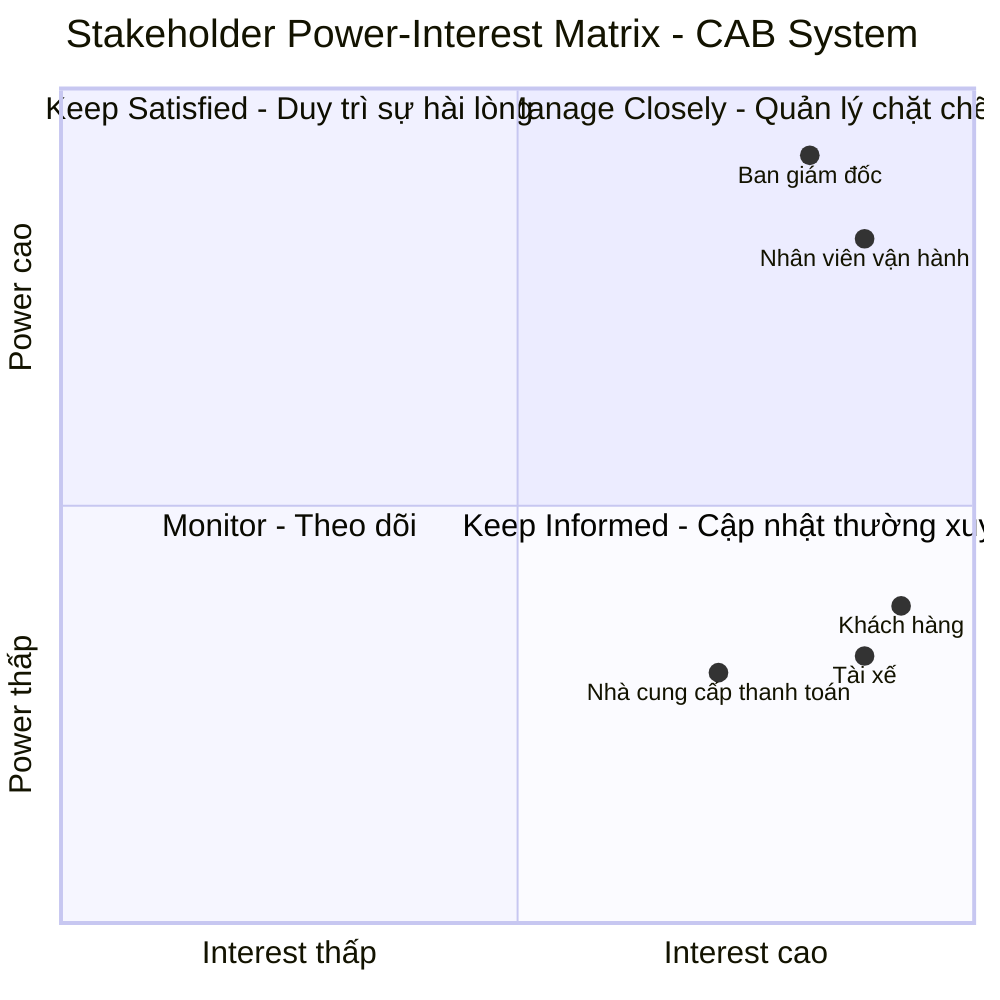
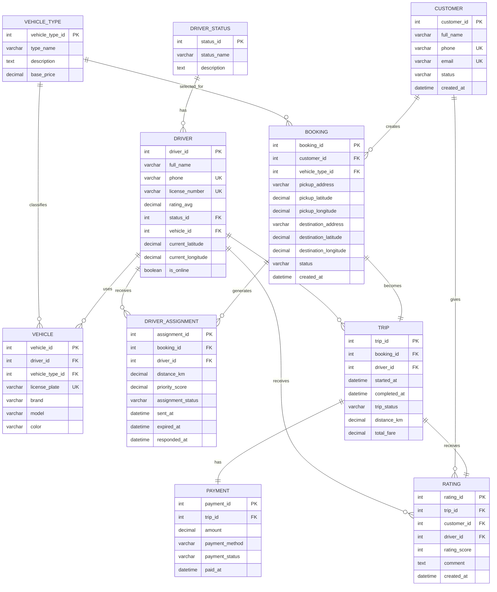
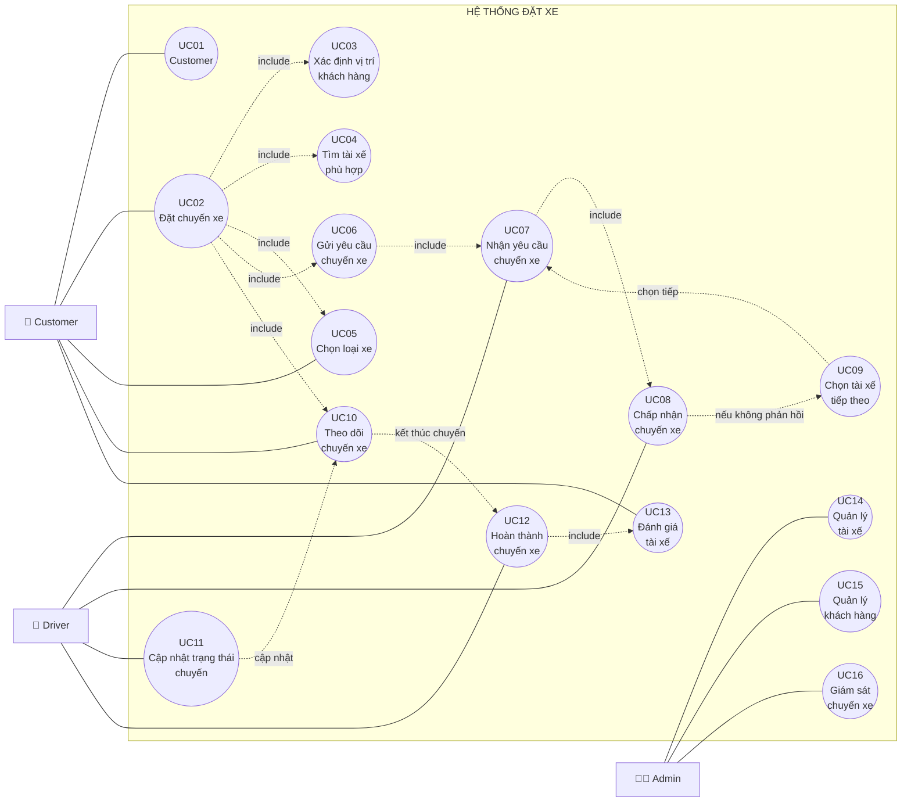
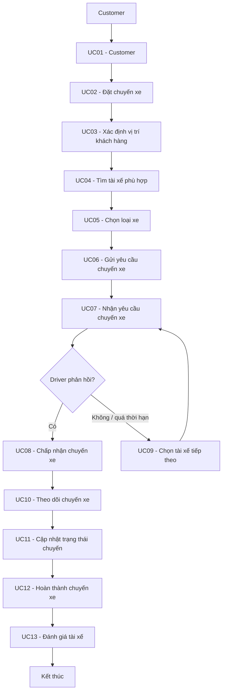
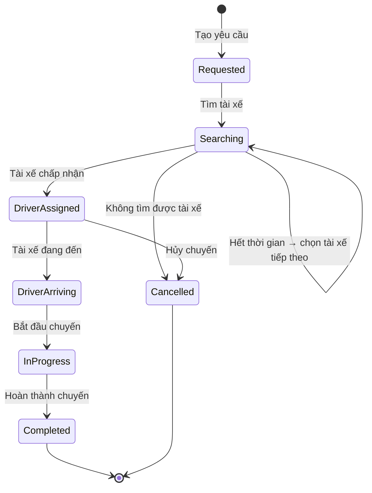
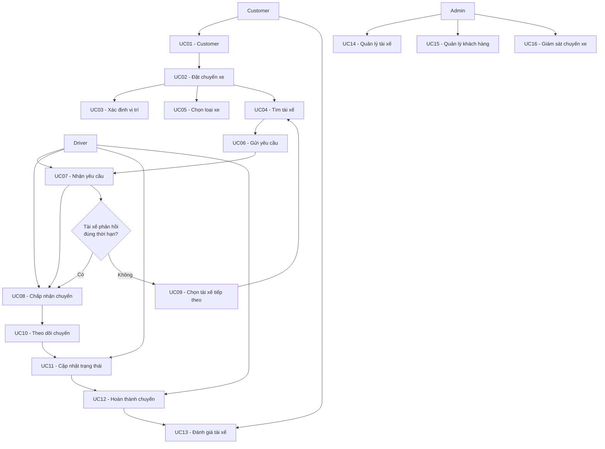
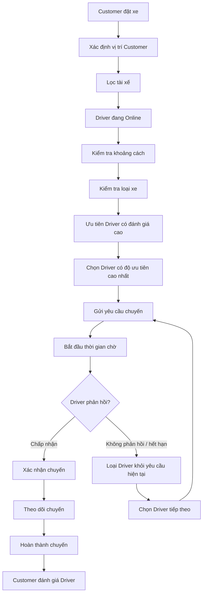

# B1. ĐỌC VÀ PHÂN TÍCH YÊU CẦU SƠ KHỞI CỦA KHÁCH HÀNG Ở GIAI ĐOẠN 1

## 1. Tổng quan yêu cầu

Dựa trên tài liệu **“Yêu cầu của khách hàng – Dự án xây dựng hệ thống CAB System – Nền tảng đặt xe”**, Công ty ABC hiện đang cung cấp dịch vụ đặt xe trực tuyến thông qua tổng đài và một ứng dụng đơn giản. Tuy nhiên, hệ thống hiện tại còn tồn tại nhiều hạn chế như việc phân công tài xế chủ yếu được thực hiện thủ công, khách hàng khó theo dõi trạng thái chuyến đi, thông tin thanh toán chưa được quản lý tập trung và hệ thống gặp khó khăn trong việc mở rộng khi số lượng khách hàng và tài xế tăng lên.

Vì vậy, khách hàng mong muốn xây dựng một **nền tảng CAB System mới**, không chỉ đáp ứng nhu cầu đặt xe hiện tại mà còn có khả năng phục vụ số lượng lớn người dùng và hỗ trợ mở rộng thêm các tính năng trong tương lai. Thời gian dự kiến xây dựng và triển khai sản phẩm là **7 tuần**.

## 2. Xác định các tác nhân chính

Qua phân tích yêu cầu sơ khởi, hệ thống có ba nhóm tác nhân chính:

### 2.1. Khách hàng

Khách hàng là người sử dụng dịch vụ đặt xe. Các nhu cầu chính gồm:

* Đăng ký và đăng nhập tài khoản.
* Cập nhật thông tin cá nhân.
* Nhập điểm đón và điểm đến.
* Lựa chọn loại xe.
* Gửi yêu cầu đặt xe.
* Theo dõi trạng thái yêu cầu và chuyến đi.
* Biết tài xế nào đã nhận chuyến và thời gian dự kiến tài xế đến.
* Xem lịch sử chuyến đi và số tiền phải trả.
* Đánh giá tài xế sau khi chuyến đi hoàn thành.

### 2.2. Tài xế

Tài xế là tác nhân trực tiếp thực hiện chuyến xe. Hệ thống cần hỗ trợ:

* Đăng ký tài khoản hoặc được nhân viên vận hành tạo tài khoản.
* Cập nhật hồ sơ và thông tin phương tiện.
* Cập nhật trạng thái hoạt động.
* Chuyển sang trạng thái sẵn sàng nhận chuyến.
* Nhận thông báo khi có chuyến phù hợp.
* Chấp nhận hoặc từ chối chuyến.
* Cập nhật trạng thái chuyến đi.
* Cung cấp thông tin vị trí để hỗ trợ việc tìm tài xế và dự kiến thời gian đến.

### 2.3. Nhân viên vận hành

Nhân viên vận hành chịu trách nhiệm quản lý và hỗ trợ hoạt động của hệ thống. Các chức năng chính gồm:

* Quản lý khách hàng, tài xế và phương tiện.
* Quản lý các chuyến đi.
* Theo dõi các chuyến đang diễn ra.
* Kiểm tra trạng thái tài xế.
* Hỗ trợ xử lý các chuyến bị lỗi.
* Tra cứu lịch sử giao dịch.
* Thực hiện các thao tác quản trị theo quyền được cấp.
* Theo dõi các báo cáo về số lượng chuyến, doanh thu, tỷ lệ hoàn thành, tỷ lệ hủy và hiệu quả hoạt động của tài xế.

## 3. Phân tích các nhóm yêu cầu chức năng

Từ yêu cầu sơ khởi, có thể xác định các nhóm chức năng chính của CAB System như sau:

### 3.1. Quản lý tài khoản

Hệ thống cần hỗ trợ đăng ký, đăng nhập và cập nhật thông tin đối với khách hàng và tài xế. Người dùng phải được xác thực trước khi sử dụng các chức năng yêu cầu tài khoản.

### 3.2. Đặt và quản lý chuyến xe

Khách hàng có thể nhập điểm đón, điểm đến, lựa chọn loại xe và gửi yêu cầu đặt xe. Sau khi tạo yêu cầu, khách hàng cần theo dõi được quá trình tìm tài xế, tài xế nhận chuyến, thời gian dự kiến đến và trạng thái chuyến đi.

### 3.3. Tìm kiếm và phân công tài xế

Đây là một trong những chức năng nghiệp vụ quan trọng nhất. Khi có yêu cầu đặt xe, hệ thống cần xác định những tài xế phù hợp dựa trên vị trí, trạng thái sẵn sàng và các tiêu chí vận hành khác.

Hệ thống ưu tiên tài xế phù hợp và gần khách hàng. Nếu tài xế được đề xuất không phản hồi hoặc từ chối, hệ thống phải tiếp tục tìm tài xế khác mà không yêu cầu khách hàng tạo lại yêu cầu. Nếu không tìm được tài xế, khách hàng phải nhận được thông báo rõ ràng.

### 3.4. Tính cước và thanh toán

Sau khi chuyến đi hoàn thành, hệ thống cần xác định số tiền khách hàng phải thanh toán dựa trên loại dịch vụ và thông tin chuyến đi.

Hệ thống hỗ trợ hai hình thức thanh toán:

* Thanh toán tiền mặt.
* Thanh toán điện tử thông qua nhà cung cấp thanh toán bên ngoài.

Thông tin nhạy cảm của thẻ hoặc tài khoản thanh toán không được lưu trực tiếp trong hệ thống CAB. Trong trường hợp giao dịch điện tử thất bại, hệ thống phải thông báo cho khách hàng và hỗ trợ xử lý lại theo chính sách của doanh nghiệp.

### 3.5. Hệ thống thông báo

Thông báo được sử dụng để cập nhật trạng thái cho khách hàng và tài xế.

Khách hàng cần được thông báo khi:

* Yêu cầu đặt xe được tiếp nhận.
* Tài xế nhận chuyến.
* Tài xế đến điểm đón.
* Chuyến đi hoàn thành.
* Thanh toán có kết quả.

Tài xế cũng cần nhận thông báo về chuyến mới hoặc những thay đổi liên quan đến chuyến đang thực hiện. Hệ thống cần có khả năng mở rộng thêm các kênh thông báo trong tương lai.

### 3.6. Quản trị và báo cáo

Hệ thống cần cung cấp giao diện quản trị để nhân viên vận hành quản lý các đối tượng và theo dõi hoạt động. Đồng thời, ban lãnh đạo cần có các báo cáo phục vụ việc đánh giá hiệu quả kinh doanh và vận hành, bao gồm số lượng chuyến, doanh thu, tỷ lệ hoàn thành, tỷ lệ hủy và hiệu quả hoạt động của tài xế.

## 4. Phân tích yêu cầu phi chức năng

Bên cạnh các chức năng nghiệp vụ, khách hàng đặt ra nhiều yêu cầu liên quan đến chất lượng và kiến trúc hệ thống.

### 4.1. Khả năng mở rộng

Hệ thống phải có khả năng phục vụ số lượng lớn khách hàng và tài xế. Khi tải tăng, các thành phần của hệ thống cần có khả năng mở rộng độc lập.

### 4.2. Tính ổn định và khả năng chịu lỗi

Một lỗi xảy ra tại một thành phần, chẳng hạn thanh toán hoặc thông báo, không được làm toàn bộ hệ thống đặt xe ngừng hoạt động.

### 4.3. Khả năng triển khai và phát triển từng phần

Các chức năng mới cần có khả năng được triển khai từng phần, hạn chế ảnh hưởng đến những chức năng đang hoạt động.

### 4.4. Bảo mật

Hệ thống phải:

* Xác thực khách hàng và tài xế trước khi sử dụng các chức năng yêu cầu tài khoản.
* Kiểm soát quyền truy cập đối với các thao tác quản trị.
* Bảo vệ thông tin cá nhân.
* Bảo vệ thông tin phương tiện, dữ liệu vị trí và dữ liệu giao dịch.
* Lưu vết các thao tác quan trọng để phục vụ kiểm tra khi xảy ra sự cố.

### 4.5. Tính linh hoạt trong tương lai

Kiến trúc hệ thống cần đủ linh hoạt để có thể:

* Bổ sung loại dịch vụ mới.
* Thêm phương thức thanh toán.
* Thêm nhà cung cấp dịch vụ thông báo.
* Thay đổi một số thành phần kỹ thuật.

Các thay đổi trên không nên yêu cầu xây dựng lại toàn bộ ứng dụng.

## 5. Các quy tắc nghiệp vụ sơ bộ

Từ yêu cầu của khách hàng, có thể xác định một số quy tắc nghiệp vụ ban đầu:

1. Tài xế cần ở trạng thái sẵn sàng để có thể nhận chuyến.
2. Hệ thống ưu tiên tài xế phù hợp và gần khách hàng.
3. Nếu tài xế không phản hồi hoặc từ chối, hệ thống tiếp tục tìm tài xế khác.
4. Khách hàng không cần tạo lại yêu cầu khi hệ thống chuyển sang tìm tài xế khác.
5. Nếu không tìm được tài xế, hệ thống phải thông báo rõ ràng cho khách hàng.
6. Sau khi chuyến đi hoàn thành, hệ thống xác định số tiền khách hàng phải trả.
7. Thông tin thanh toán nhạy cảm không được lưu trực tiếp trong hệ thống CAB.
8. Các chức năng quản trị nhạy cảm phải được kiểm soát bằng cơ chế phân quyền.
9. Các sự kiện quan trọng của chuyến đi và thanh toán cần được thông báo đến các bên liên quan.

## 6. Các vấn đề chưa rõ cần được làm rõ

Qua phân tích, yêu cầu sơ khởi **chưa đủ chi tiết để có thể chuyển ngay sang thiết kế và phát triển hệ thống**. Tài liệu xác định một số vấn đề cần Business Analyst trao đổi thêm với các bên liên quan, bao gồm:

* Cách tính cước cụ thể.
* Tiêu chí ưu tiên tài xế.
* Thời gian tài xế phải phản hồi yêu cầu.
* Chính sách hủy chuyến.
* Cách xử lý khi mất kết nối mạng.
* Thời gian lưu trữ dữ liệu.
* Chính sách xử lý khi thanh toán điện tử thất bại.
* Các tiêu chí vận hành khác được sử dụng trong quá trình tìm và phân công tài xế.

Đây là những nội dung cần được xác nhận trước khi nhóm phát triển xây dựng giải pháp, nhằm tránh việc hiểu sai yêu cầu hoặc phát sinh thay đổi lớn trong quá trình triển khai.

## 7. Đánh giá tổng quan yêu cầu sơ khởi

Qua phân tích, có thể đánh giá yêu cầu sơ khởi của khách hàng đã xác định tương đối rõ **mục tiêu của dự án, các nhóm người dùng, quy trình nghiệp vụ chính, các chức năng cốt lõi và những yêu cầu về bảo mật, ổn định, mở rộng**.

Tuy nhiên, yêu cầu hiện tại vẫn đang ở mức **sơ khởi**, chưa đặc tả đầy đủ các quy tắc nghiệp vụ và trường hợp ngoại lệ. Đặc biệt, các vấn đề liên quan đến tính cước, phân công tài xế, hủy chuyến, mất kết nối và lưu trữ dữ liệu vẫn cần được xác nhận với khách hàng. Do đó, vai trò của Business Analyst ở giai đoạn tiếp theo là rất quan trọng trong việc thu thập thông tin, xác định phạm vi, làm rõ yêu cầu và chuyển các yêu cầu ban đầu thành những yêu cầu có thể kiểm chứng và triển khai.

## 8. Kết luận

Từ yêu cầu sơ khởi, nhóm xác định **CAB System không chỉ là một ứng dụng đặt xe mà được định hướng trở thành một nền tảng có khả năng vận hành và mở rộng lâu dài**. Hệ thống phải hỗ trợ xuyên suốt quy trình từ tạo yêu cầu đặt xe, tìm và phân công tài xế, thực hiện chuyến, tính cước, thanh toán, thông báo đến đánh giá sau chuyến.

Bên cạnh việc đáp ứng nhu cầu của khách hàng, hệ thống còn phải hỗ trợ bộ phận vận hành quản lý tập trung, cung cấp dữ liệu phục vụ theo dõi hoạt động và đảm bảo các yêu cầu về bảo mật, ổn định, khả năng mở rộng và phát triển trong tương lai. Vì vậy, trước khi chuyển sang giai đoạn thiết kế và phát triển, nhóm cần tiếp tục làm rõ các điểm chưa xác định với khách hàng để đảm bảo yêu cầu được hiểu thống nhất giữa **khách hàng – Business Analyst – nhóm phát triển**.

# BƯỚC 2: XÁC ĐỊNH VÀ PHÂN TÍCH STAKEHOLDERS

## 1. Danh sách Stakeholders

Dựa trên tài liệu yêu cầu sơ khởi của dự án **CAB System – Nền tảng đặt xe**, nhóm xác định các stakeholder có liên quan trực tiếp hoặc được đề cập trong tài liệu như sau:

| STT   | Tên Stakeholder                               | Vai trò                                                                                                                                                                                                                            |
| ----- | --------------------------------------------- | ---------------------------------------------------------------------------------------------------------------------------------------------------------------------------------------------------------------------------------- |
| **1** | **Ban giám đốc / Ban lãnh đạo Công ty ABC**   | Là bên đưa ra định hướng và kỳ vọng đối với hệ thống. Xác định mục tiêu kinh doanh, yêu cầu về khả năng mở rộng và nhu cầu báo cáo về số lượng chuyến, doanh thu, tỷ lệ hoàn thành, tỷ lệ hủy và hiệu quả hoạt động của tài xế.    |
| **2** | **Khách hàng**                                | Là người trực tiếp sử dụng dịch vụ CAB. Khách hàng có nhu cầu đăng ký tài khoản, đặt xe, theo dõi chuyến đi, xem lịch sử chuyến, thanh toán và đánh giá tài xế sau khi hoàn thành chuyến.                                          |
| **3** | **Tài xế**                                    | Là người trực tiếp cung cấp dịch vụ vận chuyển. Tài xế thực hiện các hoạt động như quản lý hồ sơ và phương tiện, cập nhật trạng thái hoạt động, nhận hoặc từ chối chuyến, cập nhật trạng thái chuyến và cung cấp thông tin vị trí. |
| **4** | **Nhân viên vận hành**                        | Là bên quản lý và giám sát hoạt động của hệ thống. Nhân viên vận hành quản lý khách hàng, tài xế, phương tiện và chuyến đi; theo dõi các chuyến đang diễn ra, xử lý các trường hợp lỗi và tra cứu lịch sử giao dịch.               |
| **5** | **Nhà cung cấp dịch vụ thanh toán bên ngoài** | Là bên cung cấp dịch vụ thanh toán điện tử được tích hợp với CAB System. Nhà cung cấp thực hiện xử lý giao dịch thanh toán, trong khi thông tin thanh toán nhạy cảm không được lưu trực tiếp trong hệ thống CAB.                   |

### Cơ sở xác định Stakeholders

Tài liệu xác định rõ **ba nhóm người dùng chính** của hệ thống gồm **khách hàng, tài xế và nhân viên vận hành**.

Bên cạnh đó, tài liệu đề cập đến **Ban lãnh đạo/Ban giám đốc** trong việc đưa ra định hướng, kỳ vọng về khả năng mở rộng và yêu cầu báo cáo hoạt động của hệ thống.
Tài liệu cũng đề cập đến **nhà cung cấp thanh toán bên ngoài** trong yêu cầu tích hợp thanh toán điện tử.

---

# 2. Stakeholder Matrix

## 2.1. Tiêu chí đánh giá

Để đánh giá mức độ quan trọng của từng stakeholder, nhóm sử dụng **Stakeholder Power–Interest Matrix** dựa trên hai tiêu chí:

* **Power – Mức độ ảnh hưởng:** Khả năng tác động đến định hướng, phạm vi, yêu cầu và các quyết định quan trọng của hệ thống.
* **Interest – Mức độ quan tâm:** Mức độ stakeholder sử dụng, phụ thuộc hoặc chịu ảnh hưởng bởi hoạt động của CAB System.

Ma trận được chia thành bốn nhóm:

| Nhóm               | Ý nghĩa                    | Cách quản lý                                                |
| ------------------ | -------------------------- | ----------------------------------------------------------- |
| **Manage Closely** | Power cao – Interest cao   | Quản lý chặt chẽ, thường xuyên trao đổi và xác nhận yêu cầu |
| **Keep Satisfied** | Power cao – Interest thấp  | Duy trì sự hài lòng và cung cấp thông tin cần thiết         |
| **Keep Informed**  | Power thấp – Interest cao  | Cập nhật thông tin thường xuyên và tiếp nhận phản hồi       |
| **Monitor**        | Power thấp – Interest thấp | Theo dõi ở mức cần thiết                                    |

## 2.2. Stakeholder Power–Interest Matrix



> **Lưu ý:** Vị trí của các stakeholder trong ma trận là **đánh giá sơ bộ của nhóm dựa trên thông tin hiện có trong tài liệu**. Tài liệu chưa cung cấp thang đo cụ thể về quyền quyết định hoặc mức độ ảnh hưởng của từng stakeholder, do đó các vị trí trong ma trận cần được xác nhận và điều chỉnh nếu có thêm thông tin từ khách hàng.

---

# 3. Phân tích mức độ quan trọng của từng Stakeholder

## 3.1. Ban giám đốc / Ban lãnh đạo – Power cao / Interest cao

Ban giám đốc là stakeholder có mức độ ảnh hưởng cao vì đây là bên đưa ra định hướng và kỳ vọng đối với hệ thống CAB. Ban lãnh đạo quan tâm đến mục tiêu kinh doanh, khả năng mở rộng hệ thống và các báo cáo phục vụ việc đánh giá hoạt động như số lượng chuyến, doanh thu, tỷ lệ hoàn thành, tỷ lệ hủy và hiệu quả hoạt động của tài xế.

## Do đó, nhóm xác định Ban giám đốc thuộc nhóm **Manage Closely**. Cần thường xuyên trao đổi để xác nhận phạm vi, mục tiêu kinh doanh và các yêu cầu quan trọng của dự án.

## 3.2. Nhân viên vận hành – Power cao / Interest cao

Nhân viên vận hành là stakeholder có mức độ quan tâm và ảnh hưởng cao vì trực tiếp sử dụng các chức năng quản trị của hệ thống. Họ chịu trách nhiệm quản lý khách hàng, tài xế, phương tiện và chuyến đi; đồng thời theo dõi các chuyến đang diễn ra, kiểm tra trạng thái tài xế, xử lý các trường hợp lỗi và tra cứu lịch sử giao dịch.

Các yêu cầu của nhân viên vận hành có ảnh hưởng trực tiếp đến thiết kế chức năng quản trị và quy trình nghiệp vụ của hệ thống. Vì vậy, stakeholder này được xếp vào nhóm **Manage Closely**.

---

## 3.3. Khách hàng – Power thấp / Interest cao

Khách hàng là đối tượng sử dụng dịch vụ chính của CAB System và có mức độ quan tâm cao. Khách hàng trực tiếp tương tác với nhiều chức năng cốt lõi như đăng ký, đặt xe, theo dõi chuyến đi, thanh toán, xem lịch sử và đánh giá tài xế.

Tuy nhiên, trong tài liệu chưa có thông tin cho thấy khách hàng có quyền quyết định trực tiếp đối với phạm vi, kiến trúc hoặc các quyết định quản trị của dự án. Vì vậy, ở giai đoạn sơ bộ, nhóm xếp khách hàng vào nhóm **Keep Informed**.

Nhóm cần thường xuyên thu thập phản hồi của khách hàng để đảm bảo hệ thống đáp ứng đúng nhu cầu sử dụng thực tế.

---

## 3.4. Tài xế – Power thấp / Interest cao

Tài xế là stakeholder có mức độ quan tâm cao vì trực tiếp sử dụng hệ thống trong quá trình cung cấp dịch vụ. Tài xế cần quản lý hồ sơ, phương tiện, trạng thái hoạt động, nhận hoặc từ chối chuyến và cập nhật trạng thái chuyến đi. Hệ thống cũng sử dụng thông tin vị trí của tài xế để hỗ trợ tìm kiếm và phân công chuyến.

Tài liệu chưa cho thấy tài xế có quyền quyết định trực tiếp đối với phạm vi hoặc định hướng của hệ thống. Do đó, nhóm xếp tài xế vào nhóm **Keep Informed** và cần thường xuyên tiếp nhận phản hồi từ tài xế trong quá trình phân tích yêu cầu.

---

## 3.5. Nhà cung cấp dịch vụ thanh toán bên ngoài – Power thấp / Interest cao

Nhà cung cấp dịch vụ thanh toán bên ngoài là stakeholder có liên quan đến chức năng thanh toán điện tử của hệ thống. CAB System cần tích hợp với nhà cung cấp này để thực hiện giao dịch thanh toán, đồng thời không lưu trực tiếp thông tin thanh toán nhạy cảm trong hệ thống CAB.

Tuy nhiên, tài liệu chưa mô tả rõ quyền quyết định hoặc mức độ ảnh hưởng của nhà cung cấp thanh toán đối với toàn bộ dự án. Vì vậy, nhóm tạm thời xếp stakeholder này vào nhóm **Keep Informed**.

Trong các giai đoạn tiếp theo, Business Analyst cần làm rõ các yêu cầu tích hợp, phương thức trao đổi dữ liệu, xử lý giao dịch thất bại và các giới hạn kỹ thuật từ phía nhà cung cấp thanh toán.

---

# 4. Tổng hợp Stakeholder Matrix

| Stakeholder                           | Power | Interest | Nhóm               | Cách quản lý                                            |
| ------------------------------------- | ----- | -------- | ------------------ | ------------------------------------------------------- |
| **Ban giám đốc / Ban lãnh đạo**       | Cao   | Cao      | **Manage Closely** | Thường xuyên trao đổi, xác nhận mục tiêu và yêu cầu     |
| **Nhân viên vận hành**                | Cao   | Cao      | **Manage Closely** | Tham gia phân tích nghiệp vụ và xác nhận quy trình      |
| **Khách hàng**                        | Thấp  | Cao      | **Keep Informed**  | Thu thập phản hồi và cập nhật thông tin                 |
| **Tài xế**                            | Thấp  | Cao      | **Keep Informed**  | Thu thập phản hồi về quy trình nhận và thực hiện chuyến |
| **Nhà cung cấp thanh toán bên ngoài** | Thấp* | Cao      | **Keep Informed**  | Phối hợp và xác nhận yêu cầu tích hợp                   |

> ***** Mức Power của nhà cung cấp thanh toán chỉ là đánh giá sơ bộ vì tài liệu chưa mô tả cụ thể quyền hạn và mức độ ảnh hưởng của stakeholder này.

---

# 5. Kết luận

Qua quá trình phân tích, nhóm xác định **05 stakeholder chính** có liên quan trực tiếp hoặc được đề cập trong tài liệu yêu cầu của CAB System, bao gồm: **Ban giám đốc/Ban lãnh đạo, Khách hàng, Tài xế, Nhân viên vận hành và Nhà cung cấp dịch vụ thanh toán bên ngoài**.

Trong đó, **Ban giám đốc và Nhân viên vận hành** được đánh giá là những stakeholder có mức độ ảnh hưởng và quan tâm cao, do đó cần được **quản lý chặt chẽ** trong quá trình phân tích và phát triển hệ thống.

**Khách hàng và Tài xế** là hai nhóm người dùng trực tiếp của hệ thống, có mức độ quan tâm cao và cần được thường xuyên thu thập phản hồi để đảm bảo các chức năng đáp ứng đúng nhu cầu thực tế.

**Nhà cung cấp dịch vụ thanh toán bên ngoài** là stakeholder bên ngoài có liên quan đến một chức năng quan trọng của hệ thống. Tuy nhiên, do tài liệu chưa cung cấp đầy đủ thông tin về quyền hạn và mức độ ảnh hưởng của bên này, nhóm chỉ đánh giá ở mức sơ bộ và cần tiếp tục xác nhận trong các bước phân tích tiếp theo.

Việc xác định và phân loại stakeholder giúp nhóm Business Analyst xác định **ai cần được trao đổi thường xuyên, ai cần được tham gia xác nhận yêu cầu và ai cần được cập nhật thông tin**, từ đó hạn chế nguy cơ bỏ sót yêu cầu hoặc xảy ra mâu thuẫn giữa các bên liên quan trong quá trình xây dựng CAB System.

# BƯỚC 3: XÁC ĐỊNH CÁC BUSINESS GOAL

## 1. Khái niệm Business Goal

**Business Goal (BG)** là những mục tiêu mà doanh nghiệp mong muốn đạt được thông qua việc xây dựng hệ thống. Business Goal tập trung vào **giá trị và kết quả mà doanh nghiệp muốn đạt được**, thay vì chỉ mô tả các chức năng kỹ thuật của hệ thống.

Dựa trên yêu cầu sơ khởi của Công ty ABC, nhóm xác định các Business Goal chính của dự án **CAB System – Nền tảng đặt xe** như sau:

---

## 2. Danh sách Business Goal

| Mã       | Business Goal                                                       | Mục đích                                                                                                                           | Chức năng hệ thống hỗ trợ                                                                                                                                         |
| -------- | ------------------------------------------------------------------- | ---------------------------------------------------------------------------------------------------------------------------------- | ----------------------------------------------------------------------------------------------------------------------------------------------------------------- |
| **BG01** | **Giảm thời gian tìm và phân công tài xế**                          | Giảm sự phụ thuộc vào việc phân công tài xế thủ công, giúp khách hàng nhanh chóng được kết nối với tài xế phù hợp.                 | Tự động tìm và phân công tài xế dựa trên vị trí, trạng thái sẵn sàng và các tiêu chí vận hành; ưu tiên tài xế phù hợp và gần khách hàng.                          |
| **BG02** | **Nâng cao khả năng theo dõi và quản lý chuyến đi**                 | Giúp khách hàng và bộ phận vận hành dễ dàng theo dõi trạng thái chuyến đi, từ lúc tạo yêu cầu đến khi hoàn thành.                  | Theo dõi trạng thái chuyến, vị trí tài xế, thời gian dự kiến tài xế đến và gửi thông báo theo từng sự kiện của chuyến.                                            |
| **BG03** | **Cung cấp phương thức thanh toán thuận tiện và linh hoạt**         | Đáp ứng nhu cầu thanh toán đa dạng của khách hàng và hỗ trợ doanh nghiệp quản lý quá trình thanh toán.                             | Hỗ trợ thanh toán bằng tiền mặt và thanh toán điện tử thông qua nhà cung cấp thanh toán bên ngoài.                                                                |
| **BG04** | **Nâng cao hiệu quả quản lý và vận hành**                           | Giảm khó khăn trong công tác quản lý, giúp doanh nghiệp quản lý tập trung các đối tượng và hoạt động liên quan đến dịch vụ đặt xe. | Cung cấp giao diện quản trị để quản lý khách hàng, tài xế, phương tiện, chuyến đi, giao dịch và xử lý các trường hợp lỗi.                                         |
| **BG05** | **Xây dựng nền tảng CAB có khả năng mở rộng và phát triển lâu dài** | Đảm bảo hệ thống có thể phục vụ số lượng lớn khách hàng và tài xế, đồng thời đáp ứng nhu cầu bổ sung tính năng trong tương lai.    | Thiết kế hệ thống có khả năng mở rộng độc lập, cho phép bổ sung loại dịch vụ, phương thức thanh toán, nhà cung cấp thông báo và thay đổi các thành phần kỹ thuật. |

---

# 3. Phân tích chi tiết từng Business Goal

## BG01 – Giảm thời gian tìm và phân công tài xế

### Mục tiêu

Giảm thời gian tìm kiếm và phân công tài xế, đồng thời giảm sự phụ thuộc vào quá trình phân công thủ công hiện tại.

### Cơ sở xác định

Hệ thống hiện tại của Công ty ABC có hạn chế là việc phân công tài xế chủ yếu được thực hiện thủ công. Doanh nghiệp mong muốn xây dựng một nền tảng mới có khả năng phục vụ số lượng lớn khách hàng và tài xế.

### Chức năng hệ thống hỗ trợ

Khi khách hàng tạo yêu cầu đặt xe, hệ thống cần:

1. Xác định các tài xế phù hợp.
2. Kiểm tra vị trí của tài xế.
3. Kiểm tra trạng thái sẵn sàng nhận chuyến.
4. Áp dụng các tiêu chí vận hành để lựa chọn tài xế.
5. Ưu tiên tài xế phù hợp và gần khách hàng.
6. Nếu tài xế không phản hồi hoặc từ chối, tiếp tục tìm tài xế khác.
7. Nếu không tìm được tài xế, thông báo rõ ràng cho khách hàng.

### Giá trị mang lại

Business Goal này giúp doanh nghiệp giảm thao tác thủ công trong quá trình điều phối, nâng cao hiệu quả phân công tài xế và cải thiện trải nghiệm đặt xe của khách hàng.

---

## BG02 – Nâng cao khả năng theo dõi và quản lý chuyến đi

### Mục tiêu

Cải thiện khả năng theo dõi chuyến đi, giúp khách hàng biết được tình trạng yêu cầu đặt xe và giúp nhân viên vận hành có thể giám sát các chuyến đang diễn ra.

### Cơ sở xác định

Một hạn chế của hệ thống hiện tại là khách hàng khó theo dõi trạng thái chuyến đi. Hệ thống mới cần cho phép khách hàng biết hệ thống đang tìm tài xế, tài xế nào đã nhận chuyến, thời gian dự kiến tài xế đến và trạng thái hiện tại của chuyến.

### Chức năng hệ thống hỗ trợ

Hệ thống cần hỗ trợ theo dõi các trạng thái chính của chuyến:

```text
Khách hàng tạo yêu cầu
        ↓
Đang tìm tài xế
        ↓
Tài xế đã nhận chuyến
        ↓
Tài xế đến điểm đón
        ↓
Đã đón khách
        ↓
Đang di chuyển
        ↓
Hoàn thành chuyến
```

Ngoài ra, hệ thống cần lưu thông tin vị trí của tài xế để hỗ trợ tìm tài xế gần khách hàng và cải thiện khả năng dự kiến thời gian tài xế đến.

Hệ thống cũng phải gửi thông báo cho khách hàng khi yêu cầu được tiếp nhận, tài xế nhận chuyến, tài xế đến điểm đón và chuyến hoàn thành.

### Giá trị mang lại

Business Goal này giúp tăng tính minh bạch của dịch vụ, giúp khách hàng chủ động theo dõi chuyến đi và giúp bộ phận vận hành có khả năng giám sát, hỗ trợ xử lý các chuyến đang diễn ra.

---

## BG03 – Cung cấp phương thức thanh toán thuận tiện và linh hoạt

### Mục tiêu

Đáp ứng nhu cầu thanh toán đa dạng của khách hàng bằng cách hỗ trợ cả thanh toán trực tiếp và thanh toán điện tử.

### Cơ sở xác định

Tài liệu yêu cầu hệ thống sau khi chuyến đi hoàn thành phải xác định số tiền khách hàng phải trả. Khách hàng có thể thanh toán bằng **tiền mặt hoặc phương thức thanh toán điện tử**. Doanh nghiệp mong muốn tích hợp với một nhà cung cấp thanh toán bên ngoài.

### Chức năng hệ thống hỗ trợ

Hệ thống cần:

* Tính số tiền khách hàng phải trả dựa trên loại dịch vụ và thông tin chuyến đi.
* Hỗ trợ thanh toán bằng tiền mặt.
* Hỗ trợ thanh toán điện tử.
* Tích hợp với nhà cung cấp thanh toán bên ngoài.
* Không lưu trực tiếp thông tin nhạy cảm của thẻ hoặc tài khoản thanh toán.
* Thông báo kết quả giao dịch cho khách hàng.
* Cho phép xử lý lại khi giao dịch điện tử thất bại theo chính sách của doanh nghiệp.

### Giá trị mang lại

Business Goal này giúp tăng sự thuận tiện cho khách hàng, đồng thời tạo nền tảng cho doanh nghiệp quản lý quá trình tính cước và thanh toán một cách tập trung.

---

## BG04 – Nâng cao hiệu quả quản lý và vận hành

### Mục tiêu

Cải thiện khả năng quản lý tập trung và hỗ trợ nhân viên vận hành trong việc giám sát hoạt động của hệ thống CAB.

### Cơ sở xác định

Doanh nghiệp yêu cầu một giao diện quản trị để quản lý khách hàng, tài xế, phương tiện và chuyến đi. Nhân viên vận hành cũng cần theo dõi các chuyến đang diễn ra, kiểm tra trạng thái tài xế, xử lý các chuyến bị lỗi và tra cứu lịch sử giao dịch.

### Chức năng hệ thống hỗ trợ

Hệ thống cần cung cấp:

* Giao diện quản trị.
* Quản lý khách hàng.
* Quản lý tài xế.
* Quản lý phương tiện.
* Quản lý chuyến đi.
* Theo dõi các chuyến đang diễn ra.
* Kiểm tra trạng thái tài xế.
* Hỗ trợ xử lý các chuyến bị lỗi.
* Tra cứu lịch sử giao dịch.
* Phân quyền các chức năng quản trị.
* Báo cáo số lượng chuyến, doanh thu, tỷ lệ hoàn thành, tỷ lệ hủy và hiệu quả hoạt động của tài xế.

### Giá trị mang lại

Business Goal này giúp giảm khó khăn trong công tác vận hành, tăng khả năng kiểm soát hoạt động và cung cấp dữ liệu cần thiết để doanh nghiệp đánh giá hiệu quả kinh doanh.

---

## BG05 – Xây dựng nền tảng CAB có khả năng mở rộng và phát triển lâu dài

### Mục tiêu

Xây dựng CAB System không chỉ đáp ứng nhu cầu đặt xe hiện tại mà còn có khả năng mở rộng khi số lượng người dùng tăng và khi doanh nghiệp phát triển thêm các dịch vụ, phương thức thanh toán hoặc thành phần kỹ thuật mới.

### Cơ sở xác định

Ban lãnh đạo mong muốn hệ thống mới có thể phục vụ số lượng lớn khách hàng và tài xế, đồng thời có thể phát triển thêm các tính năng trong tương lai.

Tài liệu cũng yêu cầu các thành phần của hệ thống có khả năng mở rộng độc lập khi tải tăng và các chức năng mới có thể được triển khai từng phần mà hạn chế ảnh hưởng đến các chức năng đang hoạt động.

### Chức năng / đặc tính hệ thống hỗ trợ

Hệ thống cần có khả năng:

* Mở rộng khi số lượng khách hàng và tài xế tăng.
* Mở rộng độc lập các thành phần khi tải tăng.
* Bổ sung các loại dịch vụ mới.
* Bổ sung phương thức thanh toán mới.
* Bổ sung nhà cung cấp thông báo mới.
* Thay đổi một số thành phần kỹ thuật mà không phải xây dựng lại toàn bộ ứng dụng.
* Triển khai chức năng mới từng phần và hạn chế ảnh hưởng đến hệ thống đang hoạt động.

### Giá trị mang lại

Business Goal này giúp doanh nghiệp có một nền tảng có khả năng phát triển lâu dài, giảm sự phụ thuộc vào việc xây dựng lại toàn bộ hệ thống khi nhu cầu kinh doanh thay đổi.

---

# 4. Mối quan hệ giữa Business Goal và chức năng hệ thống

Các Business Goal trên được chuyển hóa thành các nhóm chức năng chính của CAB System như sau:

| Business Goal                                                          | Chức năng hệ thống hỗ trợ                                                                            |
| ---------------------------------------------------------------------- | ---------------------------------------------------------------------------------------------------- |
| **BG01 – Giảm thời gian tìm và phân công tài xế**                      | Tìm tài xế, xác định tài xế phù hợp, ưu tiên tài xế gần khách hàng, tự động tìm tài xế tiếp theo     |
| **BG02 – Nâng cao khả năng theo dõi và quản lý chuyến đi**             | Theo dõi trạng thái chuyến, theo dõi vị trí, dự kiến thời gian đến, thông báo                        |
| **BG03 – Cung cấp phương thức thanh toán thuận tiện và linh hoạt**     | Tính cước, thanh toán tiền mặt, thanh toán điện tử, tích hợp nhà cung cấp thanh toán                 |
| **BG04 – Nâng cao hiệu quả quản lý và vận hành**                       | Giao diện quản trị, quản lý dữ liệu, giám sát chuyến, xử lý sự cố, báo cáo                           |
| **BG05 – Xây dựng nền tảng có khả năng mở rộng và phát triển lâu dài** | Kiến trúc mở rộng, triển khai từng phần, bổ sung dịch vụ, phương thức thanh toán và nhà cung cấp mới |

---

# 5. Kết luận

Qua phân tích yêu cầu sơ khởi, nhóm xác định **05 Business Goal chính** cho dự án CAB System:

1. **BG01 – Giảm thời gian tìm và phân công tài xế.**
2. **BG02 – Nâng cao khả năng theo dõi và quản lý chuyến đi.**
3. **BG03 – Cung cấp phương thức thanh toán thuận tiện và linh hoạt.**
4. **BG04 – Nâng cao hiệu quả quản lý và vận hành.**
5. **BG05 – Xây dựng nền tảng CAB có khả năng mở rộng và phát triển lâu dài.**

Các Business Goal này thể hiện những kết quả mà Công ty ABC mong muốn đạt được thông qua việc xây dựng hệ thống, trong khi các chức năng của CAB System đóng vai trò là phương tiện để hỗ trợ đạt được những mục tiêu đó.

Trong đó, **BG01** tập trung giải quyết vấn đề phân công tài xế thủ công; **BG02** giải quyết vấn đề khó theo dõi chuyến đi; **BG03** đáp ứng nhu cầu thanh toán bằng tiền mặt và trực tuyến; **BG04** cải thiện hoạt động quản lý và vận hành; và **BG05** đảm bảo hệ thống có khả năng mở rộng, phát triển lâu dài theo định hướng của doanh nghiệp. Những mục tiêu này được xây dựng dựa trên các vấn đề hiện tại và kỳ vọng của khách hàng được nêu trong tài liệu yêu cầu.

# BƯỚC 4: XÁC ĐỊNH PHẠM VI YÊU CẦU VÀ CÁC MODULE CỦA HỆ THỐNG

## 1. Mục tiêu xác định phạm vi

Sau khi phân tích yêu cầu sơ khởi và xác định các Business Goal, nhóm tiến hành xác định **phạm vi của hệ thống CAB System** nhằm làm rõ:

* Những chức năng và yêu cầu nào **cần thực hiện trong dự án**.
* Những chức năng nào **chưa thực hiện hoặc không thuộc phạm vi hiện tại**.
* Xác định các **module nghiệp vụ cơ bản** của hệ thống.
* Làm cơ sở để phân chia công việc, xác định yêu cầu và lập kế hoạch phát triển.
* Hạn chế tình trạng **scope creep** – phát sinh thêm chức năng ngoài phạm vi trong quá trình phát triển.

Theo tài liệu, CAB System được định hướng là một nền tảng đặt xe có khả năng hỗ trợ toàn bộ quy trình từ **tạo yêu cầu đặt xe → tìm và phân công tài xế → thực hiện chuyến → tính cước → thanh toán → thông báo → đánh giá sau chuyến**.

---

# 2. Phạm vi của hệ thống

## 2.1. Phạm vi trong dự án (In Scope)

Các chức năng dưới đây được xác định là **nằm trong phạm vi thực hiện** dựa trên yêu cầu khách hàng.

### 1. Quản lý tài khoản và người dùng

* Đăng ký tài khoản khách hàng.
* Đăng nhập.
* Cập nhật thông tin cá nhân.
* Quản lý tài khoản tài xế.
* Tạo tài khoản tài xế bởi nhân viên vận hành.
* Cập nhật hồ sơ tài xế.
* Quản lý thông tin phương tiện.
* Xác thực người dùng trước khi sử dụng chức năng yêu cầu tài khoản.

### 2. Đặt xe

* Nhập điểm đón.
* Nhập điểm đến.
* Lựa chọn loại xe.
* Gửi yêu cầu đặt xe.
* Theo dõi quá trình xử lý yêu cầu đặt xe.

### 3. Tìm kiếm và phân công tài xế

* Xác định tài xế phù hợp.
* Kiểm tra trạng thái sẵn sàng của tài xế.
* Sử dụng vị trí tài xế để hỗ trợ tìm kiếm.
* Ưu tiên tài xế phù hợp và gần khách hàng.
* Gửi yêu cầu chuyến đến tài xế.
* Cho phép tài xế chấp nhận hoặc từ chối chuyến.
* Tự động tìm tài xế khác nếu tài xế không phản hồi hoặc từ chối.
* Thông báo cho khách hàng nếu không tìm được tài xế.

### 4. Quản lý và theo dõi chuyến đi

* Theo dõi trạng thái chuyến.
* Hiển thị tài xế đã nhận chuyến.
* Hiển thị thời gian dự kiến tài xế đến.
* Tài xế cập nhật trạng thái:

  * Đã đến điểm đón.
  * Đã đón khách.
  * Đang di chuyển.
  * Hoàn thành chuyến.
* Lưu thông tin vị trí tài xế.
* Theo dõi các chuyến đang diễn ra.

### 5. Tính cước và thanh toán

* Xác định số tiền khách hàng phải trả.
* Tính cước dựa trên loại dịch vụ và thông tin chuyến đi.
* Thanh toán bằng tiền mặt.
* Thanh toán điện tử.
* Tích hợp với nhà cung cấp thanh toán bên ngoài.
* Không lưu trực tiếp thông tin thanh toán nhạy cảm.
* Thông báo kết quả thanh toán.
* Xử lý lại giao dịch thanh toán điện tử thất bại theo chính sách doanh nghiệp.

### 6. Thông báo

* Thông báo khi yêu cầu đặt xe được tiếp nhận.
* Thông báo khi tài xế nhận chuyến.
* Thông báo khi tài xế đến điểm đón.
* Thông báo khi chuyến hoàn thành.
* Thông báo kết quả thanh toán.
* Thông báo cho tài xế về chuyến mới.
* Thông báo các thay đổi liên quan đến chuyến đang thực hiện.
* Thiết kế theo hướng có thể mở rộng thêm các kênh thông báo trong tương lai.

### 7. Quản trị và vận hành

* Quản lý khách hàng.
* Quản lý tài xế.
* Quản lý phương tiện.
* Quản lý chuyến đi.
* Theo dõi các chuyến đang diễn ra.
* Kiểm tra trạng thái tài xế.
* Xử lý các trường hợp chuyến bị lỗi.
* Tra cứu lịch sử giao dịch.
* Phân quyền chức năng quản trị.
* Lưu vết các thao tác quan trọng.

### 8. Báo cáo

Hệ thống cần hỗ trợ các báo cáo phục vụ quản lý:

* Số lượng chuyến.
* Doanh thu.
* Tỷ lệ chuyến hoàn thành.
* Tỷ lệ hủy.
* Hiệu quả hoạt động của tài xế.

---

# 3. Yêu cầu phi chức năng trong phạm vi

Ngoài các chức năng nghiệp vụ, các yêu cầu phi chức năng sau cũng thuộc phạm vi của dự án.

| Mã        | Yêu cầu                    | Nội dung                                                                                          |
| --------- | -------------------------- | ------------------------------------------------------------------------------------------------- |
| **NFR01** | Khả năng mở rộng           | Hệ thống có thể phục vụ số lượng lớn khách hàng và tài xế.                                        |
| **NFR02** | Tính ổn định               | Lỗi tại thanh toán hoặc thông báo không được làm toàn bộ hệ thống đặt xe ngừng hoạt động.         |
| **NFR03** | Khả năng mở rộng độc lập   | Các thành phần có thể mở rộng độc lập khi tải tăng.                                               |
| **NFR04** | Triển khai từng phần       | Chức năng mới có thể được triển khai từng phần và hạn chế ảnh hưởng đến chức năng đang hoạt động. |
| **NFR05** | Bảo mật                    | Xác thực người dùng và kiểm soát quyền truy cập đối với các chức năng quản trị.                   |
| **NFR06** | Bảo vệ dữ liệu             | Bảo vệ thông tin cá nhân, phương tiện, vị trí và giao dịch.                                       |
| **NFR07** | Audit Log                  | Lưu vết các thao tác quan trọng để phục vụ kiểm tra khi có sự cố.                                 |
| **NFR08** | Khả năng mở rộng chức năng | Có thể bổ sung dịch vụ, phương thức thanh toán và nhà cung cấp thông báo trong tương lai.         |

Các yêu cầu trên được xác định trực tiếp từ phần yêu cầu về tính ổn định, khả năng mở rộng, triển khai, bảo mật và khả năng phát triển lâu dài của hệ thống.

---

# 4. Xác định các Module cơ bản

Dựa trên phạm vi yêu cầu, nhóm chia CAB System thành các **module nghiệp vụ chính** như sau:

| Mã Module | Module                 | Mục đích chính                              |
| --------- | ---------------------- | ------------------------------------------- |
| **M01**   | Quản lý tài khoản      | Quản lý tài khoản và thông tin người dùng   |
| **M02**   | Đặt xe                 | Tiếp nhận và quản lý yêu cầu đặt xe         |
| **M03**   | Tìm & phân công tài xế | Tìm tài xế phù hợp và thực hiện phân công   |
| **M04**   | Quản lý chuyến đi      | Quản lý trạng thái và thông tin chuyến      |
| **M05**   | Tính cước & thanh toán | Tính tiền và xử lý thanh toán               |
| **M06**   | Thông báo              | Gửi thông báo đến khách hàng và tài xế      |
| **M07**   | Quản trị & vận hành    | Quản lý và giám sát toàn bộ hoạt động       |
| **M08**   | Báo cáo                | Cung cấp dữ liệu và báo cáo phục vụ quản lý |

---

# 5. MBB – Module Business Breakdown

Bảng MBB được sử dụng để phân rã hệ thống thành các module nghiệp vụ và xác định phạm vi chức năng chính của từng module.

| Module                           | Chức năng chính                                                                             | Đối tượng liên quan                    | Trong phạm vi |
| -------------------------------- | ------------------------------------------------------------------------------------------- | -------------------------------------- | :-----------: |
| **M01 – Quản lý tài khoản**      | Đăng ký, đăng nhập, cập nhật thông tin, quản lý hồ sơ tài xế, quản lý phương tiện, xác thực | Khách hàng, Tài xế, Nhân viên vận hành |       ✅       |
| **M02 – Đặt xe**                 | Nhập điểm đón, điểm đến, chọn loại xe, tạo yêu cầu                                          | Khách hàng                             |       ✅       |
| **M03 – Tìm & phân công tài xế** | Tìm tài xế, kiểm tra trạng thái, ưu tiên tài xế gần, chuyển sang tài xế khác                | Khách hàng, Tài xế, Hệ thống           |       ✅       |
| **M04 – Quản lý chuyến đi**      | Theo dõi và cập nhật trạng thái chuyến, vị trí tài xế, lịch sử chuyến                       | Khách hàng, Tài xế, Nhân viên vận hành |       ✅       |
| **M05 – Tính cước & thanh toán** | Tính cước, tiền mặt, thanh toán điện tử, xử lý giao dịch thất bại                           | Khách hàng, Nhà cung cấp thanh toán    |       ✅       |
| **M06 – Thông báo**              | Thông báo đặt xe, nhận chuyến, đến điểm đón, hoàn thành, thanh toán                         | Khách hàng, Tài xế                     |       ✅       |
| **M07 – Quản trị & vận hành**    | Quản lý khách hàng, tài xế, phương tiện, chuyến, giao dịch, xử lý lỗi, phân quyền           | Nhân viên vận hành                     |       ✅       |
| **M08 – Báo cáo**                | Báo cáo số chuyến, doanh thu, hoàn thành, hủy, hiệu quả tài xế                              | Ban giám đốc, Nhân viên vận hành       |       ✅       |

---

# 6. Những nội dung nên thực hiện

Dựa trên tài liệu, nhóm **nên thực hiện** các nội dung sau trong phạm vi dự án:

### Ưu tiên 1 – Chức năng cốt lõi

* [x] Đăng ký và đăng nhập.
* [x] Quản lý thông tin khách hàng và tài xế.
* [x] Tạo yêu cầu đặt xe.
* [x] Tìm và phân công tài xế.
* [x] Chấp nhận/từ chối chuyến.
* [x] Tự động tìm tài xế tiếp theo.
* [x] Theo dõi trạng thái chuyến.
* [x] Cập nhật trạng thái chuyến.
* [x] Tính cước.
* [x] Thanh toán tiền mặt.
* [x] Thanh toán điện tử.
* [x] Thông báo các sự kiện quan trọng.

### Ưu tiên 2 – Quản trị và vận hành

* [x] Quản lý khách hàng.
* [x] Quản lý tài xế.
* [x] Quản lý phương tiện.
* [x] Quản lý chuyến đi.
* [x] Theo dõi chuyến đang diễn ra.
* [x] Xử lý chuyến bị lỗi.
* [x] Tra cứu giao dịch.
* [x] Phân quyền quản trị.
* [x] Báo cáo hoạt động.

### Ưu tiên 3 – Yêu cầu nền tảng

* [x] Xác thực và phân quyền.
* [x] Bảo vệ dữ liệu.
* [x] Lưu vết thao tác quan trọng.
* [x] Khả năng mở rộng.
* [x] Khả năng triển khai từng phần.
* [x] Khả năng tích hợp thêm dịch vụ trong tương lai.

---

# 7. Những nội dung chưa nên thực hiện trong phạm vi hiện tại

Tài liệu **không mô tả chi tiết** một số nghiệp vụ. Vì vậy, nhóm **không nên tự ý xây dựng hoặc chốt yêu cầu** cho các nội dung này khi chưa được khách hàng xác nhận.

| Nội dung                                                              | Trạng thái       | Lý do                                                                                                     |
| --------------------------------------------------------------------- | ---------------- | --------------------------------------------------------------------------------------------------------- |
| **Cách tính cước chi tiết**                                           | ⚠️ Chưa chốt     | Tài liệu chỉ yêu cầu tính cước dựa trên loại dịch vụ và thông tin chuyến, chưa xác định công thức cụ thể. |
| **Tiêu chí ưu tiên tài xế chi tiết**                                  | ⚠️ Chưa chốt     | Chưa xác định cụ thể trọng số hoặc thứ tự ưu tiên.                                                        |
| **Thời gian tài xế phải phản hồi**                                    | ⚠️ Chưa chốt     | Tài liệu chưa đưa ra thời gian cụ thể.                                                                    |
| **Chính sách hủy chuyến**                                             | ⚠️ Chưa chốt     | Chưa xác định điều kiện, phí hoặc quy trình xử lý.                                                        |
| **Xử lý mất kết nối mạng**                                            | ⚠️ Chưa chốt     | Tài liệu yêu cầu BA làm rõ nhưng chưa đưa ra giải pháp cụ thể.                                            |
| **Thời gian lưu trữ dữ liệu**                                         | ⚠️ Chưa chốt     | Chưa có thời gian lưu trữ cụ thể.                                                                         |
| **Chi tiết xử lý thanh toán thất bại**                                | ⚠️ Chưa chốt     | Chỉ yêu cầu cho phép xử lý lại theo chính sách doanh nghiệp.                                              |
| **Các dịch vụ đặt xe mới ngoài phạm vi hiện tại**                     | ❌ Chưa thực hiện | Chỉ yêu cầu kiến trúc có khả năng mở rộng để bổ sung trong tương lai.                                     |
| **Các phương thức thanh toán mới ngoài tiền mặt và điện tử hiện tại** | ❌ Chưa thực hiện | Chỉ cần đảm bảo kiến trúc có khả năng mở rộng.                                                            |
| **Các nhà cung cấp thông báo mới**                                    | ❌ Chưa thực hiện | Tài liệu chỉ yêu cầu khả năng bổ sung trong tương lai.                                                    |

Tài liệu xác nhận rõ các vấn đề như **cách tính cước, tiêu chí ưu tiên tài xế, thời gian phản hồi, chính sách hủy chuyến, mất kết nối mạng và thời gian lưu trữ dữ liệu** vẫn cần được Business Analyst làm rõ với các bên liên quan.

---

# 8. Out of Scope – Ngoài phạm vi thực hiện hiện tại

Để tránh mở rộng phạm vi ngoài yêu cầu của khách hàng, nhóm xác định các nội dung sau **chưa thuộc phạm vi triển khai hiện tại**:

* Các loại dịch vụ CAB mới chưa được khách hàng xác định.
* Các phương thức thanh toán mới ngoài những phương thức được yêu cầu.
* Các nhà cung cấp thông báo mới chưa được xác định.
* Các chính sách nghiệp vụ chưa được khách hàng chốt.
* Các chức năng chưa được đề cập trong tài liệu yêu cầu.

> **Lưu ý:** Việc xác định Out of Scope không có nghĩa các chức năng này sẽ không bao giờ được phát triển. Tài liệu cho biết kiến trúc CAB System cần đủ linh hoạt để có thể bổ sung các dịch vụ, phương thức thanh toán và nhà cung cấp mới trong tương lai.

---

# 9. Phạm vi tổng quát của CAB System

Có thể mô tả phạm vi hệ thống theo chuỗi nghiệp vụ chính:

```text
Khách hàng
    │
    ▼
[Đăng ký / Đăng nhập]
    │
    ▼
[Tạo yêu cầu đặt xe]
    │
    ▼
[Tìm & phân công tài xế]
    │
    ├── Tài xế nhận chuyến
    │
    └── Từ chối / Không phản hồi
                │
                ▼
        [Tìm tài xế khác]
                │
                ▼
       [Thực hiện chuyến]
                │
                ▼
          [Tính cước]
                │
        ┌───────┴───────┐
        ▼               ▼
   [Tiền mặt]    [Thanh toán điện tử]
        │               │
        └───────┬───────┘
                ▼
          [Hoàn thành]
                │
                ▼
         [Đánh giá tài xế]
```

Song song với quy trình trên:

```text
              ┌─────────────────────┐
              │ Nhân viên vận hành  │
              └──────────┬──────────┘
                         │
                         ▼
              [Quản trị & giám sát]
                         │
        ┌────────────────┼────────────────┐
        ▼                ▼                ▼
    Khách hàng        Tài xế          Chuyến đi
        │                │                │
        └────────────────┼────────────────┘
                         ▼
                    [Giao dịch]
                         │
                         ▼
                     [Báo cáo]
```

---

# 10. Kết luận

Qua bước xác định phạm vi, nhóm xác định **CAB System tập trung vào quy trình nghiệp vụ cốt lõi của nền tảng đặt xe**, bao gồm:

> **Quản lý tài khoản → Đặt xe → Tìm và phân công tài xế → Quản lý chuyến đi → Tính cước & thanh toán → Thông báo → Quản trị & vận hành → Báo cáo.**

Trong phạm vi dự án, nhóm ưu tiên triển khai các chức năng cần thiết để đáp ứng các Business Goal đã xác định ở Bước 3, đặc biệt là **giảm thời gian tìm tài xế, nâng cao khả năng theo dõi chuyến đi, hỗ trợ thanh toán linh hoạt và nâng cao hiệu quả vận hành**.

Đồng thời, nhóm **không tự ý đặc tả những yêu cầu mà khách hàng chưa chốt**. Các nội dung như công thức tính cước, tiêu chí ưu tiên tài xế, thời gian phản hồi, chính sách hủy chuyến, xử lý mất kết nối và thời gian lưu trữ dữ liệu sẽ được đưa vào danh sách cần làm rõ với stakeholder trước khi triển khai. Điều này giúp kiểm soát phạm vi và hạn chế phát sinh yêu cầu ngoài kế hoạch.

Việc phân chia thành các module M01–M08 và bảng MBB giúp nhóm có cơ sở để tiếp tục thực hiện các bước phân tích chi tiết hơn như **Use Case, yêu cầu chức năng, Business Rule, Acceptance Criteria và phân chia công việc phát triển**.

BƯỚC 5: XÁC ĐỊNH BUSINESS REQUIREMENTS
1. Mục đích

Sau khi xác định các Stakeholders, Business Goals và phạm vi hệ thống, nhóm tiến hành chuyển các yêu cầu ở các bước trước thành các Business Requirements (BR).

Business Requirement mô tả điều doanh nghiệp cần hệ thống đáp ứng để đạt được mục tiêu kinh doanh, tập trung vào nhu cầu nghiệp vụ thay vì đi sâu vào cách triển khai kỹ thuật.

Các Business Requirement được xây dựng dựa trên:

Yêu cầu sơ khởi của khách hàng.
Các Business Goal đã xác định ở Bước 3.
Phạm vi hệ thống đã xác định ở Bước 4.
Nhu cầu của các stakeholder chính.

Tài liệu yêu cầu xác định quy trình tổng thể của CAB System từ tạo yêu cầu đặt xe → tìm và phân công tài xế → thực hiện chuyến → tính cước → thanh toán → thông báo → đánh giá sau chuyến.

2. Danh sách Business Requirements
Mã / STT	Tên Business Requirement	Diễn giải
BR01	Quản lý tài khoản khách hàng	Hệ thống phải cho phép khách hàng đăng ký tài khoản, đăng nhập và cập nhật thông tin cá nhân trước khi sử dụng các chức năng yêu cầu tài khoản.
BR02	Quản lý tài khoản và hồ sơ tài xế	Hệ thống phải cho phép tài xế đăng ký hoặc được nhân viên vận hành tạo tài khoản, cập nhật hồ sơ, thông tin phương tiện và trạng thái hoạt động.
BR03	Tạo yêu cầu đặt xe	Hệ thống phải cho phép khách hàng nhập điểm đón, điểm đến, lựa chọn loại xe và gửi yêu cầu đặt xe.
BR04	Tìm kiếm và phân công tài xế	Hệ thống phải hỗ trợ xác định tài xế phù hợp dựa trên vị trí, trạng thái sẵn sàng và các tiêu chí vận hành; ưu tiên tài xế phù hợp và gần khách hàng.
BR05	Xử lý trường hợp tài xế từ chối hoặc không phản hồi	Khi tài xế được đề xuất không nhận chuyến hoặc không phản hồi, hệ thống phải tiếp tục tìm tài xế khác mà không yêu cầu khách hàng tạo lại yêu cầu. Nếu không tìm được tài xế, hệ thống phải thông báo rõ ràng cho khách hàng.
BR06	Theo dõi và quản lý chuyến đi	Hệ thống phải cho phép khách hàng theo dõi trạng thái chuyến, tài xế đã nhận chuyến, thời gian dự kiến đến và các trạng thái trong quá trình thực hiện chuyến.
BR07	Quản lý vị trí tài xế	Hệ thống phải lưu và sử dụng thông tin vị trí của tài xế để hỗ trợ tìm tài xế gần khách hàng và cải thiện khả năng dự kiến thời gian đến.
BR08	Cập nhật trạng thái chuyến	Hệ thống phải cho phép tài xế cập nhật các trạng thái của chuyến trong quá trình thực hiện, từ khi nhận chuyến đến khi hoàn thành.
BR09	Tính cước chuyến đi	Sau khi chuyến hoàn thành, hệ thống phải xác định số tiền khách hàng phải trả dựa trên loại dịch vụ và thông tin chuyến đi.
BR10	Hỗ trợ thanh toán đa phương thức	Hệ thống phải hỗ trợ khách hàng thanh toán bằng tiền mặt hoặc phương thức thanh toán điện tử.
BR11	Tích hợp nhà cung cấp thanh toán bên ngoài	Hệ thống phải tích hợp với nhà cung cấp dịch vụ thanh toán bên ngoài và không lưu trực tiếp thông tin nhạy cảm của thẻ hoặc tài khoản thanh toán trong CAB System.
BR12	Xử lý giao dịch thanh toán thất bại	Khi giao dịch thanh toán điện tử thất bại, hệ thống phải thông báo cho khách hàng và cho phép xử lý lại theo chính sách của doanh nghiệp.
BR13	Cung cấp hệ thống thông báo	Hệ thống phải gửi thông báo cho khách hàng và tài xế về các sự kiện quan trọng như tiếp nhận yêu cầu, nhận chuyến, tài xế đến điểm đón, hoàn thành chuyến và kết quả thanh toán.
BR14	Quản lý khách hàng, tài xế, phương tiện và chuyến đi	Hệ thống phải cung cấp giao diện quản trị để nhân viên vận hành quản lý các đối tượng và hoạt động chính của hệ thống.
BR15	Giám sát và xử lý chuyến đi	Nhân viên vận hành phải có khả năng xem các chuyến đang diễn ra, kiểm tra trạng thái tài xế và hỗ trợ xử lý các trường hợp chuyến bị lỗi.
BR16	Quản lý và tra cứu giao dịch	Hệ thống phải cho phép nhân viên vận hành tra cứu lịch sử giao dịch phục vụ công tác quản lý và xử lý sự cố.
BR17	Phân quyền quản trị	Hệ thống phải kiểm soát quyền truy cập đối với các chức năng quản trị để nhân viên thông thường không thể thực hiện các thao tác nhạy cảm.
BR18	Cung cấp báo cáo quản trị	Hệ thống phải cung cấp các báo cáo về số lượng chuyến, doanh thu, tỷ lệ hoàn thành, tỷ lệ hủy và hiệu quả hoạt động của tài xế.
BR19	Đảm bảo tính ổn định của hệ thống	Hệ thống phải hoạt động ổn định trong thời điểm nhu cầu tăng cao và lỗi tại một thành phần như thanh toán hoặc thông báo không được làm toàn bộ hệ thống đặt xe ngừng hoạt động.
BR20	Đảm bảo khả năng mở rộng	Hệ thống phải có khả năng mở rộng các thành phần độc lập khi tải tăng và có thể phục vụ số lượng lớn khách hàng và tài xế.
BR21	Hỗ trợ triển khai chức năng từng phần	Các chức năng mới phải có khả năng được triển khai từng phần và hạn chế ảnh hưởng đến các chức năng đang hoạt động.
BR22	Bảo mật và bảo vệ dữ liệu	Hệ thống phải xác thực khách hàng và tài xế trước khi sử dụng chức năng yêu cầu tài khoản, kiểm soát quyền quản trị và bảo vệ thông tin cá nhân, phương tiện, vị trí và giao dịch.
BR23	Lưu vết hoạt động quan trọng	Hệ thống phải lưu vết các thao tác quan trọng để phục vụ kiểm tra, truy xuất và điều tra khi xảy ra sự cố.
BR24	Hỗ trợ khả năng mở rộng chức năng trong tương lai	Kiến trúc hệ thống phải đủ linh hoạt để có thể bổ sung loại dịch vụ, phương thức thanh toán, nhà cung cấp thông báo hoặc thay đổi một số thành phần kỹ thuật mà không phải xây dựng lại toàn bộ ứng dụng.

Các yêu cầu trên được chuyển đổi từ những nội dung khách hàng đã nêu về người dùng, đặt xe, tìm tài xế, thanh toán, thông báo, quản trị, báo cáo, khả năng mở rộng và bảo mật.

3. Liên kết Business Goal với Business Requirement

Để chứng minh các Business Requirement không được xây dựng một cách rời rạc, nhóm liên kết từng requirement với các Business Goal đã xác định ở Bước 3.

Business Goal	Business Requirements liên quan
BG01 – Giảm thời gian tìm và phân công tài xế	BR04, BR05, BR07
BG02 – Nâng cao khả năng theo dõi và quản lý chuyến đi	BR06, BR07, BR08, BR13, BR15
BG03 – Cung cấp phương thức thanh toán thuận tiện và linh hoạt	BR09, BR10, BR11, BR12
BG04 – Nâng cao hiệu quả quản lý và vận hành	BR14, BR15, BR16, BR17, BR18, BR23
BG05 – Xây dựng nền tảng có khả năng mở rộng và phát triển lâu dài	BR19, BR20, BR21, BR24
4. Phân tích một số Business Requirement quan trọng
BR04 – Tìm kiếm và phân công tài xế

Business Requirement:

Hệ thống phải hỗ trợ xác định tài xế phù hợp dựa trên vị trí, trạng thái sẵn sàng và các tiêu chí vận hành; đồng thời ưu tiên tài xế phù hợp và gần khách hàng.

Liên kết Business Goal: BG01 – Giảm thời gian tìm và phân công tài xế.

Cơ sở: Tài liệu xác định việc tìm tài xế là yêu cầu quan trọng; hệ thống phải dựa trên vị trí, trạng thái sẵn sàng và các tiêu chí vận hành khác.

BR05 – Xử lý tài xế không phản hồi hoặc từ chối

Business Requirement:

Nếu tài xế được đề xuất không phản hồi hoặc từ chối chuyến, hệ thống phải tiếp tục tìm tài xế khác mà không yêu cầu khách hàng tạo lại yêu cầu.

Liên kết Business Goal: BG01.

Cơ sở: Đây là yêu cầu được nêu trực tiếp trong tài liệu khách hàng.

BR06 – Theo dõi chuyến đi

Business Requirement:

Hệ thống phải cho phép khách hàng theo dõi trạng thái của chuyến đi, tài xế đã nhận chuyến và thời gian dự kiến tài xế đến.

Liên kết Business Goal: BG02.

Cơ sở: Khách hàng mong muốn biết hệ thống đang tìm tài xế, tài xế nào đã nhận chuyến, thời gian dự kiến đến và trạng thái hiện tại của chuyến.

BR10 – Hỗ trợ thanh toán đa phương thức

Business Requirement:

Hệ thống phải cho phép khách hàng thanh toán bằng tiền mặt hoặc phương thức thanh toán điện tử.

Liên kết Business Goal: BG03.

Cơ sở: Tài liệu yêu cầu rõ hai phương thức thanh toán này.

BR14 – Quản trị hệ thống

Business Requirement:

Hệ thống phải cung cấp giao diện quản trị cho nhân viên vận hành để quản lý khách hàng, tài xế, phương tiện và chuyến đi.

Liên kết Business Goal: BG04.

Cơ sở: Doanh nghiệp yêu cầu giao diện quản trị phục vụ các hoạt động vận hành.

BR18 – Báo cáo quản trị

Business Requirement:

Hệ thống phải cung cấp báo cáo về số lượng chuyến, doanh thu, tỷ lệ chuyến hoàn thành, tỷ lệ hủy và hiệu quả hoạt động của tài xế.

Liên kết Business Goal: BG04.

Cơ sở: Đây là các chỉ số báo cáo được Ban lãnh đạo yêu cầu trong tài liệu.

BR20 – Khả năng mở rộng

Business Requirement:

Hệ thống phải có khả năng mở rộng các thành phần độc lập khi tải tăng và có khả năng phục vụ số lượng lớn khách hàng và tài xế.

Liên kết Business Goal: BG05.

Cơ sở: Ban lãnh đạo mong muốn nền tảng có khả năng phục vụ số lượng lớn khách hàng và tài xế; đồng thời các thành phần cần có khả năng mở rộng độc lập khi tải tăng.

5. Các yêu cầu chưa thể chuyển thành Business Requirement chính thức

Một số nội dung chưa nên đặc tả thành Business Requirement chi tiết, vì chính khách hàng xác nhận rằng chưa chốt:

Công thức tính cước cụ thể.
Tiêu chí ưu tiên tài xế cụ thể.
Thời gian tài xế phải phản hồi.
Chính sách hủy chuyến.
Cách xử lý khi mất kết nối mạng.
Thời gian lưu trữ dữ liệu.

Các nội dung này cần được Business Analyst làm rõ với stakeholder trước khi nhóm phát triển xây dựng giải pháp.

Do đó, nhóm không tự đưa ra các con số hoặc quy tắc cụ thể cho những nội dung trên để tránh biến giả định thành yêu cầu chính thức.

6. Tổng kết Business Requirements

Sau khi phân tích các yêu cầu từ khách hàng, nhóm xác định 24 Business Requirements, bao phủ các nhóm nghiệp vụ chính:

Nhóm	Business Requirements
Quản lý người dùng	BR01, BR02
Đặt xe	BR03
Tìm & phân công tài xế	BR04, BR05
Quản lý chuyến	BR06, BR07, BR08
Thanh toán	BR09, BR10, BR11, BR12
Thông báo	BR13
Quản trị & vận hành	BR14, BR15, BR16, BR17
Báo cáo	BR18
Ổn định & mở rộng	BR19, BR20, BR21, BR24
Bảo mật & kiểm soát	BR22, BR23
Kết luận
Các Business Requirement trên là bước chuyển tiếp từ Business Goal → yêu cầu nghiệp vụ cụ thể. Chúng mô tả những gì doanh nghiệp cần CAB System đáp ứng mà chưa đi sâu vào cách triển khai kỹ thuật.

BƯỚC 5: XÁC ĐỊNH BUSINESS REQUIREMENTS
1. Mục đích

Sau khi xác định các Stakeholders, Business Goals và phạm vi hệ thống, nhóm tiến hành chuyển các yêu cầu ở các bước trước thành các Business Requirements (BR).

Business Requirement mô tả điều doanh nghiệp cần hệ thống đáp ứng để đạt được mục tiêu kinh doanh, tập trung vào nhu cầu nghiệp vụ thay vì đi sâu vào cách triển khai kỹ thuật.

Các Business Requirement được xây dựng dựa trên:

Yêu cầu sơ khởi của khách hàng.
Các Business Goal đã xác định ở Bước 3.
Phạm vi hệ thống đã xác định ở Bước 4.
Nhu cầu của các stakeholder chính.

Tài liệu yêu cầu xác định quy trình tổng thể của CAB System từ tạo yêu cầu đặt xe → tìm và phân công tài xế → thực hiện chuyến → tính cước → thanh toán → thông báo → đánh giá sau chuyến.

2. Danh sách Business Requirements
Mã / STT	Tên Business Requirement	Diễn giải
BR01	Quản lý tài khoản khách hàng	Hệ thống phải cho phép khách hàng đăng ký tài khoản, đăng nhập và cập nhật thông tin cá nhân trước khi sử dụng các chức năng yêu cầu tài khoản.
BR02	Quản lý tài khoản và hồ sơ tài xế	Hệ thống phải cho phép tài xế đăng ký hoặc được nhân viên vận hành tạo tài khoản, cập nhật hồ sơ, thông tin phương tiện và trạng thái hoạt động.
BR03	Tạo yêu cầu đặt xe	Hệ thống phải cho phép khách hàng nhập điểm đón, điểm đến, lựa chọn loại xe và gửi yêu cầu đặt xe.
BR04	Tìm kiếm và phân công tài xế	Hệ thống phải hỗ trợ xác định tài xế phù hợp dựa trên vị trí, trạng thái sẵn sàng và các tiêu chí vận hành; ưu tiên tài xế phù hợp và gần khách hàng.
BR05	Xử lý trường hợp tài xế từ chối hoặc không phản hồi	Khi tài xế được đề xuất không nhận chuyến hoặc không phản hồi, hệ thống phải tiếp tục tìm tài xế khác mà không yêu cầu khách hàng tạo lại yêu cầu. Nếu không tìm được tài xế, hệ thống phải thông báo rõ ràng cho khách hàng.
BR06	Theo dõi và quản lý chuyến đi	Hệ thống phải cho phép khách hàng theo dõi trạng thái chuyến, tài xế đã nhận chuyến, thời gian dự kiến đến và các trạng thái trong quá trình thực hiện chuyến.
BR07	Quản lý vị trí tài xế	Hệ thống phải lưu và sử dụng thông tin vị trí của tài xế để hỗ trợ tìm tài xế gần khách hàng và cải thiện khả năng dự kiến thời gian đến.
BR08	Cập nhật trạng thái chuyến	Hệ thống phải cho phép tài xế cập nhật các trạng thái của chuyến trong quá trình thực hiện, từ khi nhận chuyến đến khi hoàn thành.
BR09	Tính cước chuyến đi	Sau khi chuyến hoàn thành, hệ thống phải xác định số tiền khách hàng phải trả dựa trên loại dịch vụ và thông tin chuyến đi.
BR10	Hỗ trợ thanh toán đa phương thức	Hệ thống phải hỗ trợ khách hàng thanh toán bằng tiền mặt hoặc phương thức thanh toán điện tử.
BR11	Tích hợp nhà cung cấp thanh toán bên ngoài	Hệ thống phải tích hợp với nhà cung cấp dịch vụ thanh toán bên ngoài và không lưu trực tiếp thông tin nhạy cảm của thẻ hoặc tài khoản thanh toán trong CAB System.
BR12	Xử lý giao dịch thanh toán thất bại	Khi giao dịch thanh toán điện tử thất bại, hệ thống phải thông báo cho khách hàng và cho phép xử lý lại theo chính sách của doanh nghiệp.
BR13	Cung cấp hệ thống thông báo	Hệ thống phải gửi thông báo cho khách hàng và tài xế về các sự kiện quan trọng như tiếp nhận yêu cầu, nhận chuyến, tài xế đến điểm đón, hoàn thành chuyến và kết quả thanh toán.
BR14	Quản lý khách hàng, tài xế, phương tiện và chuyến đi	Hệ thống phải cung cấp giao diện quản trị để nhân viên vận hành quản lý các đối tượng và hoạt động chính của hệ thống.
BR15	Giám sát và xử lý chuyến đi	Nhân viên vận hành phải có khả năng xem các chuyến đang diễn ra, kiểm tra trạng thái tài xế và hỗ trợ xử lý các trường hợp chuyến bị lỗi.
BR16	Quản lý và tra cứu giao dịch	Hệ thống phải cho phép nhân viên vận hành tra cứu lịch sử giao dịch phục vụ công tác quản lý và xử lý sự cố.
BR17	Phân quyền quản trị	Hệ thống phải kiểm soát quyền truy cập đối với các chức năng quản trị để nhân viên thông thường không thể thực hiện các thao tác nhạy cảm.
BR18	Cung cấp báo cáo quản trị	Hệ thống phải cung cấp các báo cáo về số lượng chuyến, doanh thu, tỷ lệ hoàn thành, tỷ lệ hủy và hiệu quả hoạt động của tài xế.
BR19	Đảm bảo tính ổn định của hệ thống	Hệ thống phải hoạt động ổn định trong thời điểm nhu cầu tăng cao và lỗi tại một thành phần như thanh toán hoặc thông báo không được làm toàn bộ hệ thống đặt xe ngừng hoạt động.
BR20	Đảm bảo khả năng mở rộng	Hệ thống phải có khả năng mở rộng các thành phần độc lập khi tải tăng và có thể phục vụ số lượng lớn khách hàng và tài xế.
BR21	Hỗ trợ triển khai chức năng từng phần	Các chức năng mới phải có khả năng được triển khai từng phần và hạn chế ảnh hưởng đến các chức năng đang hoạt động.
BR22	Bảo mật và bảo vệ dữ liệu	Hệ thống phải xác thực khách hàng và tài xế trước khi sử dụng chức năng yêu cầu tài khoản, kiểm soát quyền quản trị và bảo vệ thông tin cá nhân, phương tiện, vị trí và giao dịch.
BR23	Lưu vết hoạt động quan trọng	Hệ thống phải lưu vết các thao tác quan trọng để phục vụ kiểm tra, truy xuất và điều tra khi xảy ra sự cố.
BR24	Hỗ trợ khả năng mở rộng chức năng trong tương lai	Kiến trúc hệ thống phải đủ linh hoạt để có thể bổ sung loại dịch vụ, phương thức thanh toán, nhà cung cấp thông báo hoặc thay đổi một số thành phần kỹ thuật mà không phải xây dựng lại toàn bộ ứng dụng.

Các yêu cầu trên được chuyển đổi từ những nội dung khách hàng đã nêu về người dùng, đặt xe, tìm tài xế, thanh toán, thông báo, quản trị, báo cáo, khả năng mở rộng và bảo mật.

3. Liên kết Business Goal với Business Requirement

Để chứng minh các Business Requirement không được xây dựng một cách rời rạc, nhóm liên kết từng requirement với các Business Goal đã xác định ở Bước 3.

Business Goal	Business Requirements liên quan
BG01 – Giảm thời gian tìm và phân công tài xế	BR04, BR05, BR07
BG02 – Nâng cao khả năng theo dõi và quản lý chuyến đi	BR06, BR07, BR08, BR13, BR15
BG03 – Cung cấp phương thức thanh toán thuận tiện và linh hoạt	BR09, BR10, BR11, BR12
BG04 – Nâng cao hiệu quả quản lý và vận hành	BR14, BR15, BR16, BR17, BR18, BR23
BG05 – Xây dựng nền tảng có khả năng mở rộng và phát triển lâu dài	BR19, BR20, BR21, BR24
4. Phân tích một số Business Requirement quan trọng
BR04 – Tìm kiếm và phân công tài xế

Business Requirement:

Hệ thống phải hỗ trợ xác định tài xế phù hợp dựa trên vị trí, trạng thái sẵn sàng và các tiêu chí vận hành; đồng thời ưu tiên tài xế phù hợp và gần khách hàng.

Liên kết Business Goal: BG01 – Giảm thời gian tìm và phân công tài xế.

Cơ sở: Tài liệu xác định việc tìm tài xế là yêu cầu quan trọng; hệ thống phải dựa trên vị trí, trạng thái sẵn sàng và các tiêu chí vận hành khác.

BR05 – Xử lý tài xế không phản hồi hoặc từ chối

Business Requirement:

Nếu tài xế được đề xuất không phản hồi hoặc từ chối chuyến, hệ thống phải tiếp tục tìm tài xế khác mà không yêu cầu khách hàng tạo lại yêu cầu.

Liên kết Business Goal: BG01.

Cơ sở: Đây là yêu cầu được nêu trực tiếp trong tài liệu khách hàng.

BR06 – Theo dõi chuyến đi

Business Requirement:

Hệ thống phải cho phép khách hàng theo dõi trạng thái của chuyến đi, tài xế đã nhận chuyến và thời gian dự kiến tài xế đến.

Liên kết Business Goal: BG02.

Cơ sở: Khách hàng mong muốn biết hệ thống đang tìm tài xế, tài xế nào đã nhận chuyến, thời gian dự kiến đến và trạng thái hiện tại của chuyến.

BR10 – Hỗ trợ thanh toán đa phương thức

Business Requirement:

Hệ thống phải cho phép khách hàng thanh toán bằng tiền mặt hoặc phương thức thanh toán điện tử.

Liên kết Business Goal: BG03.

Cơ sở: Tài liệu yêu cầu rõ hai phương thức thanh toán này.

BR14 – Quản trị hệ thống

Business Requirement:

Hệ thống phải cung cấp giao diện quản trị cho nhân viên vận hành để quản lý khách hàng, tài xế, phương tiện và chuyến đi.

Liên kết Business Goal: BG04.

Cơ sở: Doanh nghiệp yêu cầu giao diện quản trị phục vụ các hoạt động vận hành.

BR18 – Báo cáo quản trị

Business Requirement:

Hệ thống phải cung cấp báo cáo về số lượng chuyến, doanh thu, tỷ lệ chuyến hoàn thành, tỷ lệ hủy và hiệu quả hoạt động của tài xế.

Liên kết Business Goal: BG04.

Cơ sở: Đây là các chỉ số báo cáo được Ban lãnh đạo yêu cầu trong tài liệu.

BR20 – Khả năng mở rộng

Business Requirement:

Hệ thống phải có khả năng mở rộng các thành phần độc lập khi tải tăng và có khả năng phục vụ số lượng lớn khách hàng và tài xế.

Liên kết Business Goal: BG05.

Cơ sở: Ban lãnh đạo mong muốn nền tảng có khả năng phục vụ số lượng lớn khách hàng và tài xế; đồng thời các thành phần cần có khả năng mở rộng độc lập khi tải tăng.

5. Các yêu cầu chưa thể chuyển thành Business Requirement chính thức

Một số nội dung chưa nên đặc tả thành Business Requirement chi tiết, vì chính khách hàng xác nhận rằng chưa chốt:

Công thức tính cước cụ thể.
Tiêu chí ưu tiên tài xế cụ thể.
Thời gian tài xế phải phản hồi.
Chính sách hủy chuyến.
Cách xử lý khi mất kết nối mạng.
Thời gian lưu trữ dữ liệu.

Các nội dung này cần được Business Analyst làm rõ với stakeholder trước khi nhóm phát triển xây dựng giải pháp.

Do đó, nhóm không tự đưa ra các con số hoặc quy tắc cụ thể cho những nội dung trên để tránh biến giả định thành yêu cầu chính thức.

6. Tổng kết Business Requirements

Sau khi phân tích các yêu cầu từ khách hàng, nhóm xác định 24 Business Requirements, bao phủ các nhóm nghiệp vụ chính:

Nhóm	Business Requirements
Quản lý người dùng	BR01, BR02
Đặt xe	BR03
Tìm & phân công tài xế	BR04, BR05
Quản lý chuyến	BR06, BR07, BR08
Thanh toán	BR09, BR10, BR11, BR12
Thông báo	BR13
Quản trị & vận hành	BR14, BR15, BR16, BR17
Báo cáo	BR18
Ổn định & mở rộng	BR19, BR20, BR21, BR24
Bảo mật & kiểm soát	BR22, BR23
Kết luận

Các Business Requirement trên là bước chuyển tiếp từ Business Goal → yêu cầu nghiệp vụ cụ thể. Chúng mô tả những gì doanh nghiệp cần CAB System đáp ứng mà chưa đi sâu vào cách triển khai kỹ thuật.
# BƯỚC 6: XÂY DỰNG CÁC BUSINESS PROCESS

## 1. Mục đích

Sau khi đã xác định **Stakeholders, Business Goals, phạm vi hệ thống và Business Requirements**, nhóm tiến hành xây dựng các **Business Process** của CAB System.

Business Process mô tả **trình tự các hoạt động nghiệp vụ từ khi một yêu cầu được phát sinh cho đến khi đạt được kết quả mong muốn**, bao gồm các tác nhân tham gia, điều kiện, các bước xử lý và các trường hợp ngoại lệ.

Việc xây dựng Business Process giúp nhóm:

* Hiểu rõ cách hệ thống hỗ trợ hoạt động nghiệp vụ thực tế.
* Xác định sự tương tác giữa **Khách hàng – Hệ thống – Tài xế – Nhân viên vận hành – Nhà cung cấp thanh toán**.
* Xác định các điểm quyết định và trường hợp ngoại lệ.
* Làm cơ sở để xây dựng **Use Case, Activity Diagram, Functional Requirement và Acceptance Criteria** ở các bước tiếp theo.
* Hạn chế việc bỏ sót các bước xử lý trong quy trình nghiệp vụ.

Dựa trên tài liệu yêu cầu của Công ty ABC, nhóm xác định các Business Process chính của CAB System gồm:

1. **BP01 – Đăng ký và quản lý tài khoản**
2. **BP02 – Tạo yêu cầu và đặt chuyến xe**
3. **BP03 – Tìm kiếm và phân công tài xế**
4. **BP04 – Thực hiện và quản lý chuyến đi**
5. **BP05 – Tính cước và thanh toán**
6. **BP06 – Gửi và xử lý thông báo**
7. **BP07 – Quản trị và giám sát vận hành**
8. **BP08 – Báo cáo hoạt động**

---

# 2. Tổng quan Business Process của CAB System

Quy trình nghiệp vụ tổng thể của CAB System có thể được mô tả như sau:

```text
                    KHÁCH HÀNG
                        │
                        ▼
              [Đăng nhập / Xác thực]
                        │
                        ▼
                [Tạo yêu cầu đặt xe]
                        │
                        ▼
              [Xác nhận điểm đón]
                        │
                        ▼
              [Xác nhận điểm đến]
                        │
                        ▼
                [Chọn loại xe]
                        │
                        ▼
                [Gửi yêu cầu]
                        │
                        ▼
              [Hệ thống tìm tài xế]
                        │
                 ┌──────┴──────┐
                 │             │
             Không có       Có tài xế
             tài xế            │
                 │              ▼
                 ▼       [Gửi yêu cầu cho
        [Thông báo cho    tài xế phù hợp]
          khách hàng]            │
                                ▼
                       [Tài xế phản hồi]
                                │
                         ┌──────┴──────┐
                         │             │
                      Từ chối/      Chấp nhận
                   không phản hồi      │
                         │             │
                         ▼             ▼
                  [Tìm tài xế      [Xác nhận
                     khác]          chuyến]
                         │             │
                         └──────┬──────┘
                                ▼
                        [Thực hiện chuyến]
                                │
                                ▼
                        [Tài xế cập nhật
                         trạng thái]
                                │
                                ▼
                         [Hoàn thành chuyến]
                                │
                                ▼
                           [Tính cước]
                                │
                         ┌──────┴──────┐
                         │             │
                      Tiền mặt     Điện tử
                         │             │
                         │        [Thanh toán]
                         │             │
                         │       ┌─────┴─────┐
                         │       │           │
                         │     Thành công   Thất bại
                         │       │           │
                         │       │           ▼
                         │       │     [Thông báo &
                         │       │      xử lý lại]
                         │       │
                         └───────┴──────┐
                                        ▼
                               [Hoàn tất chuyến]
                                        │
                                        ▼
                              [Đánh giá tài xế]
```

---

# 3. BP01 – Business Process: Đăng ký và quản lý tài khoản

## 3.1. Mục tiêu

Cho phép khách hàng và tài xế có tài khoản hợp lệ để sử dụng các chức năng yêu cầu xác thực.

## 3.2. Tác nhân

* Khách hàng
* Tài xế
* Nhân viên vận hành
* Hệ thống CAB

## 3.3. Quy trình

```text
        Người dùng
            │
            ▼
     [Yêu cầu đăng ký]
            │
            ▼
    [Nhập thông tin tài khoản]
            │
            ▼
      [Hệ thống kiểm tra]
            │
       ┌────┴────┐
       │         │
    Không hợp lệ Hợp lệ
       │         │
       ▼         ▼
 [Thông báo lỗi] [Tạo tài khoản]
                     │
                     ▼
               [Xác thực tài khoản]
                     │
                     ▼
               [Đăng nhập hệ thống]
                     │
                     ▼
               [Sử dụng dịch vụ]
```

Đối với tài xế, ngoài thông tin tài khoản còn cần quản lý:

* Hồ sơ tài xế.
* Thông tin phương tiện.
* Trạng thái hoạt động.
* Trạng thái sẵn sàng nhận chuyến.

Nhân viên vận hành có thể thực hiện việc tạo tài khoản tài xế theo yêu cầu của doanh nghiệp.

## 3.4. Kết quả

Người dùng có tài khoản hợp lệ và có thể sử dụng các chức năng tương ứng với quyền được cấp.

---

# 4. BP02 – Business Process: Tạo yêu cầu và đặt chuyến xe

Đây là **một trong những Business Process quan trọng nhất** của CAB System.

## 4.1. Mục tiêu

Cho phép khách hàng tạo một yêu cầu đặt xe với đầy đủ thông tin cần thiết trước khi hệ thống bắt đầu tìm kiếm tài xế.

## 4.2. Tác nhân

* Khách hàng
* Hệ thống CAB

## 4.3. Luồng nghiệp vụ chính

### Bước 1 – Khách hàng đăng nhập

Khách hàng đăng nhập vào hệ thống.

Hệ thống xác thực tài khoản trước khi cho phép sử dụng chức năng đặt xe.

### Bước 2 – Tạo chuyến đi

Khách hàng chọn chức năng **Đặt xe/Tạo chuyến**.

### Bước 3 – Nhập điểm đón

Khách hàng nhập hoặc xác định **điểm đón**.

### Bước 4 – Nhập điểm đến

Khách hàng nhập hoặc xác định **điểm đến**.

### Bước 5 – Chọn loại xe

Khách hàng lựa chọn loại xe phù hợp với nhu cầu.

### Bước 6 – Xác nhận thông tin

Hệ thống hiển thị lại các thông tin:

* Điểm đón.
* Điểm đến.
* Loại xe.
* Thông tin chuyến đi.

Khách hàng kiểm tra và xác nhận.

### Bước 7 – Gửi yêu cầu

Sau khi xác nhận, khách hàng gửi yêu cầu đặt xe.

Hệ thống ghi nhận yêu cầu và chuyển sang quy trình **tìm kiếm và phân công tài xế**.

## 4.4. Sơ đồ Business Process

```text
             KHÁCH HÀNG
                  │
                  ▼
          [Đăng nhập hệ thống]
                  │
                  ▼
           [Tạo chuyến đi]
                  │
                  ▼
          [Nhập điểm đón]
                  │
                  ▼
          [Nhập điểm đến]
                  │
                  ▼
           [Chọn loại xe]
                  │
                  ▼
        [Xác nhận thông tin]
                  │
             ┌────┴────┐
             │         │
          Không đúng   Đúng
             │         │
             ▼         ▼
        [Chỉnh sửa] [Gửi yêu cầu]
                         │
                         ▼
                 [Tìm tài xế]
```

---

# 5. BP03 – Business Process: Tìm kiếm và phân công tài xế

Đây là **Business Process cốt lõi của CAB System**, vì tài liệu khách hàng xác định việc tìm và phân công tài xế là một yêu cầu quan trọng.

## 5.1. Mục tiêu

Tự động tìm tài xế phù hợp với yêu cầu của khách hàng dựa trên:

* Vị trí tài xế.
* Trạng thái sẵn sàng.
* Loại xe.
* Các tiêu chí vận hành khác.
* Mức độ phù hợp và khoảng cách đến khách hàng.

## 5.2. Tác nhân

* Hệ thống CAB
* Tài xế
* Khách hàng

## 5.3. Luồng nghiệp vụ chính

Sau khi khách hàng gửi yêu cầu:

### Bước 1 – Tiếp nhận yêu cầu

Hệ thống tiếp nhận yêu cầu đặt xe và thông báo rằng yêu cầu đã được ghi nhận.

### Bước 2 – Xác định tài xế phù hợp

Hệ thống tìm các tài xế:

* Đang hoạt động.
* Đang ở trạng thái sẵn sàng.
* Có loại xe phù hợp.
* Có vị trí phù hợp.
* Đáp ứng các tiêu chí vận hành được doanh nghiệp xác định.

### Bước 3 – Ưu tiên tài xế

Hệ thống ưu tiên tài xế phù hợp và gần khách hàng.

> Lưu ý: Tài liệu chưa xác định công thức hoặc trọng số cụ thể để xếp hạng tài xế. Vì vậy, nhóm **không tự đưa ra khoảng cách hoặc thời gian cụ thể** ở giai đoạn này.

### Bước 4 – Gửi yêu cầu cho tài xế

Hệ thống gửi thông báo yêu cầu chuyến đến tài xế được lựa chọn.

### Bước 5 – Tài xế phản hồi

Tài xế có thể:

* Chấp nhận chuyến.
* Từ chối chuyến.
* Không phản hồi.

### Bước 6 – Nếu tài xế chấp nhận

Nếu tài xế chấp nhận:

```text
Tài xế chấp nhận
       ↓
Hệ thống xác nhận tài xế
       ↓
Thông báo cho khách hàng
       ↓
Hiển thị thông tin tài xế
       ↓
Hiển thị thời gian dự kiến đến
       ↓
Bắt đầu thực hiện chuyến
```

### Bước 7 – Nếu tài xế từ chối hoặc không phản hồi

Hệ thống **không yêu cầu khách hàng tạo lại chuyến**.

Thay vào đó:

```text
Tài xế từ chối /
không phản hồi
       ↓
Hệ thống loại tài xế
khỏi lần tìm hiện tại
       ↓
Tìm tài xế phù hợp tiếp theo
       ↓
Gửi yêu cầu cho tài xế mới
```

Quá trình tiếp tục cho đến khi:

* Có tài xế chấp nhận; hoặc
* Không còn tài xế phù hợp.

### Bước 8 – Không tìm được tài xế

Nếu không tìm được tài xế:

```text
Không còn tài xế phù hợp
          ↓
Hệ thống cập nhật trạng thái
          ↓
Thông báo cho khách hàng
          ↓
Kết thúc yêu cầu
```

Khách hàng phải nhận được thông báo rõ ràng rằng hệ thống chưa tìm được tài xế.

---

# 6. Sơ đồ Business Process – Tìm và phân công tài xế

```text
                    [Yêu cầu đặt xe]
                           │
                           ▼
                 [Hệ thống tìm tài xế]
                           │
                           ▼
                 [Kiểm tra tài xế phù hợp]
                           │
                    ┌──────┴──────┐
                    │             │
               Không tìm thấy   Tìm thấy
                    │             │
                    ▼             ▼
             [Thông báo KH] [Chọn tài xế
                    │         phù hợp]
                    │             │
                    │             ▼
                    │      [Gửi yêu cầu]
                    │             │
                    │             ▼
                    │       [Tài xế phản hồi]
                    │             │
                    │       ┌─────┴─────┐
                    │       │           │
                    │    Từ chối/    Chấp nhận
                    │   Không phản hồi   │
                    │       │           │
                    │       ▼           ▼
                    │ [Tìm tài xế    [Xác nhận
                    │     khác]       tài xế]
                    │       │           │
                    │       └─────┐     │
                    │             │     │
                    │             ▼     ▼
                    │       [Tiếp tục tìm]
                    │
                    └──────────────┐
                                   ▼
                              [Kết thúc]
```

## 6.1. Business Rule liên quan

* **BR04:** Hệ thống phải tìm tài xế phù hợp.
* **BR05:** Nếu tài xế từ chối hoặc không phản hồi, hệ thống tiếp tục tìm tài xế khác.
* Khách hàng không phải tạo lại yêu cầu.
* Nếu không tìm được tài xế, hệ thống phải thông báo rõ ràng.

---

# 7. BP04 – Business Process: Thực hiện và quản lý chuyến đi

## 7.1. Mục tiêu

Quản lý toàn bộ quá trình từ khi tài xế nhận chuyến cho đến khi chuyến hoàn thành.

## 7.2. Tác nhân

* Tài xế
* Khách hàng
* Hệ thống CAB
* Nhân viên vận hành

## 7.3. Luồng nghiệp vụ

Sau khi tài xế chấp nhận chuyến:

```text
[Tài xế nhận chuyến]
        │
        ▼
[Hệ thống xác nhận chuyến]
        │
        ▼
[Thông báo cho khách hàng]
        │
        ▼
[Tài xế di chuyển đến điểm đón]
        │
        ▼
[Tài xế cập nhật "Đã đến"]
        │
        ▼
[Đón khách]
        │
        ▼
[Tài xế cập nhật "Đã đón khách"]
        │
        ▼
[Bắt đầu di chuyển]
        │
        ▼
[Tài xế cập nhật "Đang di chuyển"]
        │
        ▼
[Đến điểm đến]
        │
        ▼
[Tài xế cập nhật "Hoàn thành"]
        │
        ▼
[Hệ thống xác nhận hoàn thành]
        │
        ▼
[Tính cước]
```

## 7.4. Các trạng thái chính của chuyến

Dựa trên yêu cầu của khách hàng, có thể xác định luồng trạng thái nghiệp vụ:

```text
Yêu cầu mới
    ↓
Đang tìm tài xế
    ↓
Đã có tài xế
    ↓
Tài xế đang đến
    ↓
Tài xế đã đến
    ↓
Đã đón khách
    ↓
Đang di chuyển
    ↓
Hoàn thành
```

## 7.5. Theo dõi chuyến

Trong quá trình thực hiện, khách hàng có thể theo dõi:

* Tài xế nào đã nhận chuyến.
* Trạng thái hiện tại của chuyến.
* Vị trí của tài xế theo thông tin hệ thống lưu nhận.
* Thời gian dự kiến tài xế đến.

Nhân viên vận hành cũng có thể theo dõi các chuyến đang diễn ra và hỗ trợ xử lý những trường hợp bất thường.

---

# 8. BP05 – Business Process: Tính cước và thanh toán

## 8.1. Mục tiêu

Xác định số tiền khách hàng phải trả sau khi chuyến đi hoàn thành và hỗ trợ thanh toán theo các phương thức được doanh nghiệp yêu cầu.

## 8.2. Tác nhân

* Khách hàng
* Hệ thống CAB
* Nhà cung cấp thanh toán bên ngoài
* Tài xế

## 8.3. Luồng nghiệp vụ

```text
          [Chuyến hoàn thành]
                  │
                  ▼
            [Tính cước]
                  │
                  ▼
        [Xác định số tiền phải trả]
                  │
                  ▼
          [Chọn phương thức]
                  │
          ┌───────┴────────┐
          │                │
       Tiền mặt       Thanh toán điện tử
          │                │
          ▼                ▼
 [Xác nhận thanh toán] [Gửi yêu cầu đến
          │             nhà cung cấp]
          │                │
          │                ▼
          │         [Xử lý giao dịch]
          │                │
          │          ┌─────┴─────┐
          │          │           │
          │       Thành công   Thất bại
          │          │           │
          │          ▼           ▼
          │      [Xác nhận] [Thông báo lỗi]
          │          │           │
          │          │      [Xử lý lại theo
          │          │       chính sách]
          │          │
          └──────────┴───────────┐
                                 ▼
                       [Cập nhật kết quả]
                                 │
                                 ▼
                         [Thông báo khách hàng]
```

## 8.4. Quy tắc nghiệp vụ

* Sau khi chuyến hoàn thành, hệ thống phải xác định số tiền phải trả.
* Hỗ trợ thanh toán tiền mặt.
* Hỗ trợ thanh toán điện tử.
* Thanh toán điện tử được thực hiện thông qua nhà cung cấp bên ngoài.
* CAB System không lưu trực tiếp thông tin nhạy cảm của thẻ hoặc tài khoản thanh toán.
* Nếu giao dịch thất bại, khách hàng phải được thông báo.
* Việc xử lý lại giao dịch được thực hiện theo chính sách của doanh nghiệp.

> **Điểm cần làm rõ:** Tài liệu chưa xác định công thức tính cước cụ thể và chính sách xử lý lại giao dịch thất bại. Vì vậy, hai nội dung này chưa được đặc tả thành quy tắc chi tiết.

---

# 9. BP06 – Business Process: Thông báo

## 9.1. Mục tiêu

Đảm bảo khách hàng và tài xế nhận được thông tin kịp thời khi trạng thái của yêu cầu hoặc chuyến đi thay đổi.

## 9.2. Các sự kiện cần thông báo

### Đối với khách hàng

Hệ thống cần thông báo khi:

1. Yêu cầu đặt xe được tiếp nhận.
2. Tài xế nhận chuyến.
3. Tài xế đến điểm đón.
4. Chuyến hoàn thành.
5. Thanh toán có kết quả.
6. Không tìm được tài xế.

### Đối với tài xế

Hệ thống cần thông báo:

1. Có chuyến mới phù hợp.
2. Có thay đổi liên quan đến chuyến đang thực hiện.

## 9.3. Business Process

```text
        [Sự kiện nghiệp vụ xảy ra]
                    │
                    ▼
             [Xác định sự kiện]
                    │
                    ▼
             [Xác định người nhận]
                    │
                    ▼
             [Tạo thông báo]
                    │
                    ▼
             [Gửi thông báo]
                    │
                    ▼
              [Cập nhật kết quả]
```

Hệ thống cần được thiết kế theo hướng có thể bổ sung thêm các kênh thông báo trong tương lai mà không phải thay đổi toàn bộ hệ thống.

---

# 10. BP07 – Business Process: Quản trị và giám sát vận hành

## 10.1. Mục tiêu

Hỗ trợ nhân viên vận hành quản lý và giám sát hoạt động của CAB System.

## 10.2. Tác nhân

* Nhân viên vận hành
* Ban lãnh đạo
* Hệ thống CAB

## 10.3. Luồng nghiệp vụ

```text
             [Nhân viên đăng nhập]
                       │
                       ▼
                [Xác thực quyền]
                       │
                       ▼
                [Giao diện quản trị]
                       │
          ┌────────────┼────────────┐
          ▼            ▼            ▼
    [Quản lý KH]   [Quản lý TX] [Quản lý xe]
          │            │            │
          └────────────┼────────────┘
                       ▼
                [Quản lý chuyến]
                       │
          ┌────────────┼────────────┐
          ▼            ▼            ▼
    [Theo dõi chuyến] [Xử lý lỗi] [Tra cứu giao dịch]
          │            │            │
          └────────────┼────────────┘
                       ▼
                  [Ghi Audit Log]
```

## 10.4. Các hoạt động chính

Nhân viên vận hành có thể:

* Quản lý khách hàng.
* Quản lý tài xế.
* Quản lý phương tiện.
* Quản lý chuyến đi.
* Theo dõi các chuyến đang diễn ra.
* Kiểm tra trạng thái tài xế.
* Hỗ trợ xử lý chuyến bị lỗi.
* Tra cứu lịch sử giao dịch.
* Thực hiện các thao tác theo quyền được cấp.

Các thao tác quản trị quan trọng phải được kiểm soát quyền truy cập và lưu vết.

---

# 11. BP08 – Business Process: Báo cáo hoạt động

## 11.1. Mục tiêu

Cung cấp dữ liệu phục vụ Ban lãnh đạo và bộ phận vận hành đánh giá hiệu quả hoạt động của CAB System.

## 11.2. Luồng nghiệp vụ

```text
          [Dữ liệu hệ thống]
                 │
        ┌────────┼────────┐
        ▼        ▼        ▼
     Chuyến   Giao dịch  Tài xế
        │        │        │
        └────────┼────────┘
                 ▼
          [Tổng hợp dữ liệu]
                 │
                 ▼
          [Tạo báo cáo]
                 │
        ┌────────┼────────┐
        ▼        ▼        ▼
    Số chuyến Doanh thu  Tỷ lệ hoàn thành
        │        │        │
        └────────┼────────┘
                 ▼
             [Báo cáo]
                 │
        ┌────────┴────────┐
        ▼                 ▼
   Ban lãnh đạo      Nhân viên vận hành
```

## 11.3. Các chỉ số báo cáo

Theo yêu cầu khách hàng, hệ thống cần hỗ trợ báo cáo:

* Số lượng chuyến.
* Doanh thu.
* Tỷ lệ chuyến hoàn thành.
* Tỷ lệ hủy.
* Hiệu quả hoạt động của tài xế.

---

# 12. Tổng hợp các Business Process

| Mã       | Business Process              | Tác nhân chính                                | Kết quả                                 |
| -------- | ----------------------------- | --------------------------------------------- | --------------------------------------- |
| **BP01** | Đăng ký và quản lý tài khoản  | Khách hàng, Tài xế, NV vận hành               | Tài khoản hợp lệ                        |
| **BP02** | Tạo yêu cầu và đặt chuyến     | Khách hàng                                    | Yêu cầu đặt xe được tạo                 |
| **BP03** | Tìm kiếm và phân công tài xế  | Hệ thống, Tài xế                              | Có tài xế hoặc thông báo không tìm được |
| **BP04** | Thực hiện và quản lý chuyến   | Tài xế, Khách hàng                            | Chuyến được hoàn thành                  |
| **BP05** | Tính cước và thanh toán       | Khách hàng, Hệ thống, Nhà cung cấp thanh toán | Giao dịch được xác nhận                 |
| **BP06** | Gửi và xử lý thông báo        | Hệ thống, Khách hàng, Tài xế                  | Thông tin được gửi đến bên liên quan    |
| **BP07** | Quản trị và giám sát vận hành | NV vận hành                                   | Hoạt động được quản lý và giám sát      |
| **BP08** | Báo cáo hoạt động             | Hệ thống, Ban lãnh đạo, NV vận hành           | Báo cáo quản trị                        |

---

# 13. Mối quan hệ giữa Business Process và Business Requirement

Các Business Process được xây dựng dựa trên các Business Requirement đã xác định ở Bước 5.

| Business Process                        | Business Requirements liên quan    |
| --------------------------------------- | ---------------------------------- |
| **BP01 – Đăng ký và quản lý tài khoản** | BR01, BR02, BR22                   |
| **BP02 – Tạo yêu cầu và đặt chuyến**    | BR03                               |
| **BP03 – Tìm kiếm và phân công tài xế** | BR04, BR05, BR07                   |
| **BP04 – Thực hiện và quản lý chuyến**  | BR06, BR07, BR08, BR13, BR15       |
| **BP05 – Tính cước và thanh toán**      | BR09, BR10, BR11, BR12             |
| **BP06 – Thông báo**                    | BR13, BR24                         |
| **BP07 – Quản trị và giám sát**         | BR14, BR15, BR16, BR17, BR22, BR23 |
| **BP08 – Báo cáo**                      | BR18                               |

Các yêu cầu phi chức năng như **BR19, BR20, BR21 và BR24** đóng vai trò xuyên suốt nhiều Business Process thay vì chỉ thuộc một quy trình riêng lẻ.

---

# 14. Business Process tổng thể của một chuyến xe

Có thể tổng hợp toàn bộ nghiệp vụ đặt xe thành quy trình sau:

```text
┌──────────────────────────┐
│ 1. KHÁCH HÀNG ĐĂNG NHẬP │
└────────────┬─────────────┘
             │
             ▼
┌──────────────────────────┐
│ 2. TẠO CHUYẾN ĐI         │
└────────────┬─────────────┘
             │
             ▼
┌──────────────────────────┐
│ 3. NHẬP ĐIỂM ĐÓN         │
└────────────┬─────────────┘
             │
             ▼
┌──────────────────────────┐
│ 4. NHẬP ĐIỂM ĐẾN         │
└────────────┬─────────────┘
             │
             ▼
┌──────────────────────────┐
│ 5. CHỌN LOẠI XE          │
└────────────┬─────────────┘
             │
             ▼
┌──────────────────────────┐
│ 6. XÁC NHẬN YÊU CẦU      │
└────────────┬─────────────┘
             │
             ▼
┌──────────────────────────┐
│ 7. HỆ THỐNG TÌM TÀI XẾ   │
└────────────┬─────────────┘
             │
        ┌────┴─────┐
        │          │
        ▼          ▼
   Không có     Có tài xế
   tài xế          │
        │          ▼
        │    ┌───────────────┐
        │    │ GỬI YÊU CẦU   │
        │    │ CHO TÀI XẾ    │
        │    └───────┬───────┘
        │            │
        │       ┌────┴────┐
        │       │         │
        │       ▼         ▼
        │    Từ chối/   Chấp nhận
        │    không PH    │
        │       │        │
        │       ▼        ▼
        │  Tìm tài xế   Xác nhận
        │    khác       chuyến
        │       │        │
        │       └───┐    │
        │           │    ▼
        │           │  Tài xế đến
        │           │    │
        │           │    ▼
        │           │  Đón khách
        │           │    │
        │           │    ▼
        │           │  Di chuyển
        │           │    │
        │           │    ▼
        │           │ Hoàn thành
        │           │    │
        │           │    ▼
        │           │ Tính cước
        │           │    │
        │           │ ┌──┴──────┐
        │           │ ▼         ▼
        │           │Tiền mặt  Điện tử
        │           │ │         │
        │           │ │    ┌────┴─────┐
        │           │ │    ▼          ▼
        │           │ │ Thành công  Thất bại
        │           │ │    │          │
        │           │ │    │     Thông báo /
        │           │ │    │     xử lý lại
        │           │ │    │          │
        └───────────┴─┴────┴──────────┘
                         │
                         ▼
                  [KẾT THÚC CHUYẾN]
                         │
                         ▼
                  [ĐÁNH GIÁ TÀI XẾ]
```

---

# 15. Các trường hợp ngoại lệ cần được làm rõ

Trong quá trình xây dựng Business Process, nhóm nhận thấy một số nhánh nghiệp vụ chưa thể đặc tả chi tiết do tài liệu khách hàng chưa chốt.

| STT | Trường hợp                     | Trạng thái                                                                     |
| --- | ------------------------------ | ------------------------------------------------------------------------------ |
| 1   | Không tìm được tài xế          | Đã xác định cần thông báo khách hàng, nhưng chưa xác định chính sách tiếp theo |
| 2   | Tài xế không phản hồi          | Đã xác định cần tìm tài xế khác, nhưng chưa xác định thời gian chờ             |
| 3   | Tài xế từ chối                 | Đã xác định cần tìm tài xế khác                                                |
| 4   | Thanh toán điện tử thất bại    | Đã xác định cần thông báo và xử lý lại theo chính sách                         |
| 5   | Mất kết nối mạng               | Chưa xác định cách xử lý cụ thể                                                |
| 6   | Khách hàng hủy chuyến          | Chưa xác định chính sách hủy chuyến                                            |
| 7   | Tài xế hủy chuyến sau khi nhận | Chưa xác định quy tắc xử lý cụ thể                                             |
| 8   | Tính cước                      | Chưa xác định công thức cụ thể                                                 |
| 9   | Ưu tiên tài xế                 | Chưa xác định tiêu chí/trọng số cụ thể                                         |
| 10  | Lưu trữ dữ liệu                | Chưa xác định thời gian lưu trữ                                                |

Nhóm **không tự ý đưa ra các quy tắc chưa được khách hàng xác nhận**, vì những giả định này có thể dẫn đến sai lệch yêu cầu.

---

# 16. Các Business Process cần ưu tiên phân tích sâu

Do thời gian xây dựng và triển khai sản phẩm dự kiến chỉ **7 tuần**, nhóm đề xuất ưu tiên phân tích sâu các Business Process có ảnh hưởng trực tiếp đến hoạt động cốt lõi của CAB System.

### Ưu tiên 1 – Quy trình đặt xe

```text
Tạo chuyến
→ Xác nhận điểm đón
→ Xác nhận điểm đến
→ Chọn loại xe
→ Gửi yêu cầu
```

### Ưu tiên 2 – Quy trình tìm và phân công tài xế

```text
Tìm tài xế
→ Kiểm tra phù hợp
→ Gửi yêu cầu
→ Chấp nhận?
→ Có: xác nhận chuyến
→ Không: tìm tài xế tiếp theo
→ Không còn: thông báo khách hàng
```

### Ưu tiên 3 – Quy trình thực hiện chuyến

```text
Nhận chuyến
→ Đang đến
→ Đã đến
→ Đón khách
→ Đang di chuyển
→ Hoàn thành
```

### Ưu tiên 4 – Quy trình thanh toán

```text
Hoàn thành chuyến
→ Tính cước
→ Chọn phương thức
→ Thanh toán
→ Xác nhận kết quả
```

Các quy trình **Thông báo, Quản trị, Giám sát và Báo cáo** được triển khai song song để hỗ trợ các quy trình cốt lõi.

---

# 17. Kết luận

Qua Bước 6, nhóm đã chuyển các Business Requirement thành các **Business Process cụ thể**, qua đó mô tả được cách CAB System hỗ trợ hoạt động kinh doanh từ đầu đến cuối.

Quy trình nghiệp vụ trung tâm của hệ thống được xác định là:

> **Tạo chuyến → Xác nhận điểm đón → Xác nhận điểm đến → Chọn loại xe → Gửi yêu cầu → Tìm tài xế → Tài xế chấp nhận/từ chối → Thực hiện chuyến → Hoàn thành → Tính cước → Thanh toán → Đánh giá.**

Trong đó, điểm quyết định quan trọng nhất là **quá trình tìm và phân công tài xế**. Nếu tìm được tài xế phù hợp và tài xế chấp nhận, hệ thống chuyển sang thực hiện chuyến. Nếu tài xế từ chối hoặc không phản hồi, hệ thống phải tiếp tục tìm tài xế khác mà khách hàng không cần tạo lại yêu cầu. Nếu không còn tài xế phù hợp, hệ thống phải thông báo rõ ràng cho khách hàng.

Bên cạnh luồng chính, nhóm cũng xác định các trường hợp ngoại lệ như **không tìm được tài xế, tài xế không phản hồi, tài xế từ chối, thanh toán thất bại, mất kết nối và hủy chuyến**. Những nội dung chưa được khách hàng chốt sẽ tiếp tục được đưa vào danh sách cần làm rõ, thay vì tự ý đặt ra quy tắc.

Business Process ở bước này là cơ sở để nhóm tiếp tục phát triển các nội dung chi tiết hơn ở các bước sau, đặc biệt là **Business Use Case, Activity Diagram, Functional Requirement, Business Rule và Acceptance Criteria**.

B7. Thiết kế Functional Requirements (FR) dựa trên Business Requirements (BR)
BR01: Tìm kiếm và lựa chọn tài xế phù hợp

Mục tiêu:
Hệ thống hỗ trợ khách hàng tìm kiếm tài xế phù hợp dựa trên vị trí hiện tại, trạng thái hoạt động, loại xe và mức độ đánh giá của tài xế.

Các Functional Requirements
FR01 – Xác định vị trí khách hàng
Hệ thống phải cho phép xác định vị trí hiện tại của khách hàng thông qua GPS.
Hệ thống phải lấy được kinh độ và vĩ độ của khách hàng.
Vị trí khách hàng được sử dụng làm điểm tham chiếu để tìm kiếm tài xế gần nhất.
FR02 – Tìm kiếm tài xế trong khu vực 1 km
Hệ thống phải tìm kiếm các tài xế trong phạm vi 1 km tính từ vị trí khách hàng.
Chỉ những tài xế đang ở trạng thái Online/Sẵn sàng nhận chuyến mới được đưa vào danh sách.
Hệ thống phải loại bỏ các tài xế đang:
Offline.
Đang thực hiện chuyến khác.
Không sẵn sàng nhận chuyến.
FR03 – Lọc tài xế theo loại xe
Hệ thống phải cho phép khách hàng lựa chọn loại xe phù hợp với nhu cầu.
Hệ thống chỉ hiển thị những tài xế đang sử dụng loại xe mà khách hàng đã lựa chọn.
Ví dụ:
Xe máy.
Ô tô 4 chỗ.
Ô tô 7 chỗ.
FR04 – Ưu tiên tài xế có đánh giá cao
Hệ thống phải lấy điểm đánh giá trung bình của từng tài xế.
Danh sách tài xế phải được sắp xếp theo mức độ ưu tiên.
Tài xế có điểm đánh giá cao hơn được ưu tiên hiển thị trước.
Trường hợp các tài xế có điểm đánh giá tương đương, hệ thống có thể ưu tiên tài xế có khoảng cách gần hơn.
FR05 – Xác định khoảng cách giữa khách hàng và tài xế
Hệ thống phải tính toán khoảng cách giữa vị trí khách hàng và từng tài xế.
Khoảng cách được tính dựa trên vị trí GPS hiện tại.
Hệ thống phải ưu tiên các tài xế đáp ứng điều kiện về khoảng cách quy định.
FR06 – Hiển thị danh sách tài xế phù hợp
Hệ thống phải hiển thị danh sách các tài xế thỏa mãn các điều kiện tìm kiếm.
Mỗi tài xế trong danh sách phải hiển thị tối thiểu:
Tên tài xế.
Hình ảnh đại diện.
Loại xe.
Biển số xe.
Điểm đánh giá.
Khoảng cách đến khách hàng.
Trạng thái Online.
FR07 – Lựa chọn tài xế
Hệ thống phải cho phép khách hàng lựa chọn một tài xế từ danh sách kết quả.
Sau khi khách hàng lựa chọn, hệ thống phải kiểm tra lại trạng thái của tài xế.
Nếu tài xế vẫn Online và sẵn sàng nhận chuyến, hệ thống tiếp tục quá trình đặt chuyến.
Nếu tài xế đã Offline hoặc nhận chuyến khác, hệ thống phải thông báo và yêu cầu khách hàng lựa chọn tài xế khác.
BR01: Tìm kiếm và lựa chọn tài xế
              │
              ▼
     FR01: Xác định vị trí
       khách hàng bằng GPS
              │
              ▼
   FR02: Tìm tài xế Online
      trong phạm vi 1 km
              │
              ▼
     FR03: Lọc theo loại xe
              │
              ▼
   FR05: Tính khoảng cách
              │
              ▼
 FR04: Ưu tiên tài xế đánh giá cao
              │
              ▼
 FR06: Hiển thị danh sách tài xế
              │
              ▼
      FR07: Khách hàng
       chọn tài xế
              │
              ▼
     Kiểm tra trạng thái
         tài xế lần cuối
              │
       ┌──────┴──────┐
       ▼             ▼
    Còn Online     Offline/
       │           Đang bận
       ▼             │
  Tiếp tục đặt       ▼
     chuyến      Chọn tài xế khác

Bảng liên kết BR → FR
Business Requirement	Functional Requirements	Mô tả
BR01 – Tìm kiếm và lựa chọn tài xế	FR01	Xác định vị trí khách hàng
	FR02	Tìm tài xế Online trong phạm vi 1 km
	FR03	Lọc tài xế theo loại xe
	FR04	Ưu tiên tài xế có đánh giá cao
	FR05	Tính khoảng cách giữa khách hàng và tài xế
	FR06	Hiển thị danh sách tài xế phù hợp
	FR07	Cho phép khách hàng lựa chọn tài xế
## BƯỚC 8: THIẾT KẾ BUSINESS RULES VÀ ACCEPTANCE CRITERIA

### Business Rules

- **BR01:** Chỉ các tài xế Online và sẵn sàng nhận chuyến mới được lựa chọn.
- **BR02:** Hệ thống chỉ tìm kiếm tài xế trong phạm vi 1 km từ vị trí khách hàng.
- **BR03:** Tài xế có điểm đánh giá cao được ưu tiên trước.
- **BR04:** Tài xế phải phản hồi yêu cầu chuyến trong thời gian quy định.
- **BR05:** Nếu tài xế từ chối hoặc quá thời hạn phản hồi, hệ thống sẽ loại tài xế đó khỏi danh sách và chọn tài xế tiếp theo.
- **BR06:** Khi tài xế nhận chuyến thành công, trạng thái tài xế chuyển sang Đang bận.
- **BR07:** Nếu không còn tài xế phù hợp, hệ thống thông báo cho khách hàng.

### Acceptance Criteria

- **AC01:** Khi khách hàng tìm tài xế, hệ thống hiển thị các tài xế Online và sẵn sàng trong phạm vi 1 km.
- **AC02:** Tài xế Offline hoặc đang bận không được hiển thị.
- **AC03:** Tài xế có đánh giá cao hơn được ưu tiên.
- **AC04:** Nếu tài xế không phản hồi trong thời hạn, hệ thống xóa tài xế khỏi danh sách và chọn tài xế tiếp theo.
- **AC05:** Nếu tài xế từ chối chuyến, hệ thống chuyển yêu cầu cho tài xế tiếp theo.
- **AC06:** Nếu tài xế nhận chuyến, hệ thống xác nhận chuyến và cập nhật trạng thái tài xế thành Đang bận.
- **AC07:** Nếu không còn tài xế phù hợp, hệ thống thông báo cho khách hàng.

BƯỚC 9: MÔ HÌNH ERD



BƯỚC 10: XÁC ĐỊNH NON-FUNCTIONAL REQUIREMENTS (NFR)
10.1. Mục tiêu

Sau khi xác định Business Rules (BR), Functional Requirements (FR) và xây dựng Data Model/ERD, bước tiếp theo là xác định các Non-Functional Requirements (NFR).

NFR mô tả các yêu cầu về chất lượng, hiệu năng, bảo mật, độ tin cậy và khả năng sử dụng của hệ thống, tức là xác định hệ thống phải hoạt động như thế nào, thay vì hệ thống phải thực hiện chức năng gì.

Đối với hệ thống đặt xe, các NFR cần tập trung vào:

Hiệu năng (Performance)
Tính khả dụng (Availability)
Bảo mật (Security)
Độ tin cậy (Reliability)
Khả năng mở rộng (Scalability)
Khả năng sử dụng (Usability)
Tính chính xác (Accuracy)
Khả năng bảo trì (Maintainability)
10.2. Danh sách Non-Functional Requirements
NFR01 – Hiệu năng tìm kiếm tài xế

Mô tả:

Hệ thống phải tìm kiếm và xác định danh sách tài xế phù hợp trong thời gian ngắn sau khi khách hàng gửi yêu cầu đặt xe.

Tiêu chí:

Hệ thống phải trả về danh sách tài xế phù hợp trong vòng ≤ 3 giây trong điều kiện tải bình thường.
Hệ thống phải ưu tiên xử lý các tài xế đang ONLINE/AVAILABLE.
Việc tìm kiếm phải dựa trên vị trí hiện tại của tài xế và khách hàng.

Liên quan:

BR01
FR01
FR02
DRIVER
BOOKING
DRIVER_ASSIGNMENT

NFR02 – Thời gian phản hồi của hệ thống

Mô tả:

Hệ thống phải phản hồi nhanh đối với các thao tác chính của người dùng.

Tiêu chí:
| Chức năng                  | Thời gian phản hồi tối đa |
| -------------------------- | ------------------------: |
| Đăng nhập                  |                  ≤ 2 giây |
| Tạo booking                |                  ≤ 3 giây |
| Tìm tài xế                 |                  ≤ 3 giây |
| Cập nhật trạng thái chuyến |                  ≤ 2 giây |
| Thanh toán                 |                  ≤ 5 giây |

10.3. NFR03 – Tính khả dụng (Availability)

Mô tả:

Hệ thống phải hoạt động ổn định để khách hàng có thể đặt xe và tài xế có thể nhận chuyến.

Tiêu chí:

Hệ thống phải có thời gian hoạt động tối thiểu 99,5%/tháng.
Hệ thống phải có khả năng hoạt động liên tục 24/7.
Khi xảy ra lỗi tạm thời, hệ thống phải thông báo cho người dùng thay vì bị treo hoặc mất dữ liệu.
10.4. NFR04 – Độ tin cậy (Reliability)

Mô tả:

Hệ thống phải đảm bảo dữ liệu và trạng thái chuyến đi được xử lý chính xác, không xảy ra tình trạng một chuyến được phân cho nhiều tài xế cùng lúc.

Tiêu chí:

Một BOOKING chỉ được xác nhận với một tài xế.
Khi một tài xế đã ACCEPTED, hệ thống phải ngừng gửi yêu cầu đến các tài xế khác.
Nếu tài xế không phản hồi trong thời gian quy định, yêu cầu phải chuyển sang EXPIRED.
Hệ thống phải tiếp tục chọn tài xế tiếp theo nếu tài xế hiện tại từ chối hoặc hết thời gian phản hồi.
10.5. NFR05 – Bảo mật (Security)

Mô tả:

Hệ thống phải bảo vệ thông tin cá nhân của khách hàng và tài xế.

Tiêu chí:

Mật khẩu phải được lưu dưới dạng mã hóa/hash.
Thông tin tài khoản phải được bảo vệ khỏi truy cập trái phép.
Chỉ người dùng có quyền mới được truy cập dữ liệu tương ứng.
Thông tin thanh toán phải được bảo vệ trong quá trình truyền và lưu trữ.
Các thao tác quan trọng phải được xác thực trước khi thực hiện.
10.6. NFR06 – Bảo vệ thông tin vị trí

Do hệ thống sử dụng vị trí của khách hàng và tài xế để tìm kiếm trong phạm vi 1 km, dữ liệu vị trí phải được bảo vệ.

Tiêu chí:

Chỉ sử dụng vị trí khi cần thiết cho việc tìm và thực hiện chuyến xe.
Không cho phép người dùng không có quyền truy cập vị trí của tài xế.
Dữ liệu vị trí phải được truyền qua kết nối an toàn.
Hệ thống không được công khai vị trí chính xác của khách hàng hoặc tài xế.
10.7. NFR07 – Tính chính xác của dữ liệu vị trí

Mô tả:

Hệ thống phải sử dụng dữ liệu vị trí đủ chính xác để xác định tài xế gần khách hàng.

Tiêu chí:

Vị trí tài xế phải được cập nhật thường xuyên khi tài xế ở trạng thái ONLINE.
Hệ thống phải tính khoảng cách dựa trên tọa độ hiện tại.
Tài xế chỉ được đưa vào danh sách ưu tiên nếu đáp ứng điều kiện khoảng cách quy định.
Khi dữ liệu vị trí không hợp lệ hoặc quá cũ, hệ thống không nên sử dụng dữ liệu đó để phân tài xế.
10.8. NFR08 – Khả năng mở rộng (Scalability)

Mô tả:

Hệ thống phải có khả năng phục vụ số lượng khách hàng và tài xế tăng lên trong tương lai.

Tiêu chí:

Có thể mở rộng số lượng người dùng mà không cần thay đổi toàn bộ hệ thống.
Có thể xử lý đồng thời nhiều yêu cầu đặt xe.
Có thể mở rộng từ phạm vi nhỏ lên nhiều khu vực/thành phố.
Database phải được thiết kế để hỗ trợ lượng dữ liệu ngày càng lớn.
10.9. NFR09 – Khả năng sử dụng (Usability)

Mô tả:

Giao diện phải đơn giản và dễ sử dụng đối với cả khách hàng và tài xế.

Tiêu chí:

Khách hàng có thể tạo yêu cầu đặt xe với số bước tối thiểu.
Thông tin quan trọng như điểm đón, loại xe, tài xế và giá tiền phải dễ nhìn.
Trạng thái chuyến xe phải được hiển thị rõ ràng.
Thông báo lỗi phải dễ hiểu và hướng dẫn người dùng cách xử lý.
10.10. NFR10 – Khả năng tương thích (Compatibility)

Hệ thống phải có khả năng hoạt động trên các nền tảng phổ biến.

Tiêu chí:

Ứng dụng khách hàng và tài xế phải hoạt động ổn định trên các thiết bị được hỗ trợ.
Hệ thống phải tương thích với các trình duyệt phổ biến nếu triển khai trên Web.
Hệ thống phải có khả năng tích hợp với dịch vụ bản đồ/GPS.
Hệ thống phải có khả năng tích hợp với các phương thức thanh toán khác nhau.
10.11. NFR11 – Khả năng bảo trì (Maintainability)

Mô tả:

Hệ thống phải được thiết kế để dễ dàng sửa lỗi, nâng cấp và bổ sung chức năng.

Tiêu chí:

Source code phải được tổ chức theo module.
Các module như Booking, Driver, Payment, Rating nên được tách biệt.
Database phải có cấu trúc rõ ràng và hạn chế dữ liệu trùng lặp.
Các lỗi hệ thống phải được ghi log để hỗ trợ việc kiểm tra và bảo trì.
10.12. NFR12 – Khả năng phục hồi dữ liệu (Backup & Recovery)

Mô tả:

Hệ thống phải có khả năng khôi phục dữ liệu khi xảy ra sự cố.

Tiêu chí:

Database phải được backup định kỳ.
Dữ liệu booking và trip không được mất khi hệ thống gặp sự cố.
Có cơ chế khôi phục dữ liệu sau lỗi.
Các giao dịch thanh toán phải đảm bảo tính toàn vẹn dữ liệu.
10.13. NFR13 – Audit và Logging

Hệ thống phải lưu lại các hoạt động quan trọng để có thể kiểm tra khi xảy ra sự cố.

Các hoạt động cần ghi log:

Đăng nhập
     ↓
Tạo Booking
     ↓
Tìm tài xế
     ↓
Gửi yêu cầu cho tài xế
     ↓
Tài xế Accept / Reject / Expired
     ↓
Bắt đầu chuyến
     ↓
Hoàn thành chuyến
     ↓
Thanh toán
     ↓
Đánh giá

Thông tin log tối thiểu:

Người thực hiện.
Thời gian thực hiện.
Hành động.
Đối tượng bị tác động.
Kết quả thực hiện.

10.14. Bảng tổng hợp NFR
| ID        | Non-Functional Requirement | Tiêu chí chính                   |
| --------- | -------------------------- | -------------------------------- |
| **NFR01** | Hiệu năng tìm tài xế       | ≤ 3 giây                         |
| **NFR02** | Thời gian phản hồi         | ≤ 2–5 giây tùy chức năng         |
| **NFR03** | Tính khả dụng              | ≥ 99,5%/tháng                    |
| **NFR04** | Độ tin cậy                 | Không phân trùng tài xế          |
| **NFR05** | Bảo mật                    | Bảo vệ tài khoản và dữ liệu      |
| **NFR06** | Bảo mật vị trí             | Chỉ sử dụng vị trí khi cần       |
| **NFR07** | Chính xác vị trí           | Cập nhật và kiểm tra dữ liệu GPS |
| **NFR08** | Khả năng mở rộng           | Hỗ trợ tăng người dùng/dữ liệu   |
| **NFR09** | Khả năng sử dụng           | Giao diện đơn giản, dễ hiểu      |
| **NFR10** | Tương thích                | Web/Mobile/Map/Payment           |
| **NFR11** | Khả năng bảo trì           | Module hóa, dễ nâng cấp          |
| **NFR12** | Backup & Recovery          | Backup và khôi phục dữ liệu      |
| **NFR13** | Logging/Audit              | Theo dõi các thao tác quan trọng |
10.15. Liên kết giữa BR – FR – NFR

Có thể tổng hợp chuỗi yêu cầu của hệ thống như sau:

BUSINESS RULE
     │
     │ BR01
     ▼
FUNCTIONAL REQUIREMENT
     │
     ├── FR01: Tìm tài xế
     ├── FR02: Tìm tài xế online trong 1KM
     ├── FR03: Lọc theo loại xe
     └── FR04: Ưu tiên tài xế đánh giá cao
     │
     ▼
DATA MODEL
     │
     ├── CUSTOMER
     ├── DRIVER
     ├── VEHICLE
     ├── BOOKING
     └── DRIVER_ASSIGNMENT
     │
     ▼
NON-FUNCTIONAL REQUIREMENT
     │
     ├── NFR01: Tìm tài xế ≤ 3 giây
     ├── NFR03: Availability ≥ 99,5%
     ├── NFR04: Không phân trùng tài xế
     ├── NFR05: Bảo mật dữ liệu
     ├── NFR07: Chính xác vị trí
     └── NFR08: Có khả năng mở rộng

Kết luận

NFR không mô tả hệ thống “làm gì”, mà mô tả hệ thống phải “làm tốt như thế nào”.

Đối với hệ thống đặt xe, các NFR quan trọng nhất cần ưu tiên là hiệu năng tìm tài xế, độ tin cậy khi phân tài xế, bảo mật thông tin cá nhân/vị trí, tính chính xác của GPS, khả năng mở rộng và tính khả dụng của hệ thống. Các NFR này sẽ được dùng làm cơ sở để đánh giá chất lượng hệ thống sau khi triển khai.

BƯỚC 11 & 12: XÁC ĐỊNH VÀ ĐẶC TẢ USE CASE

Mục tiêu: Xác định các tác nhân (Actor), các chức năng chính của hệ thống và mối quan hệ giữa Actor với Use Case. Sau đó đặc tả chi tiết từng Use Case nhằm làm rõ luồng xử lý, điều kiện và kết quả mong đợi của hệ thống.

11. XÁC ĐỊNH USE CASE
11.1. Xác định các tác nhân

Dựa trên các Functional Requirement và Business Rule đã xác định ở các bước trước, hệ thống đặt xe có các tác nhân chính:

| Actor        | Vai trò                                                                 |
| ------------ | ----------------------------------------------------------------------- |
| **Customer** | Khách hàng sử dụng hệ thống để đặt xe, theo dõi và quản lý chuyến đi    |
| **Driver**   | Tài xế nhận chuyến, thực hiện chuyến đi và cập nhật trạng thái          |
| **Admin**    | Quản trị viên quản lý người dùng, tài xế và giám sát hoạt động hệ thống |

11.2. Danh sách Use Case

| Mã UC    | Use Case                      | Actor chính | Mô tả                                                                          |
| -------- | ----------------------------- | ----------- | ------------------------------------------------------------------------------ |
| **UC01** | Customer                      | Customer    | Quản lý và thực hiện các thao tác đặt xe                                       |
| **UC02** | Đặt chuyến xe                 | Customer    | Khách hàng nhập điểm đón, điểm đến và yêu cầu đặt xe                           |
| **UC03** | Xác định vị trí khách hàng    | System      | Hệ thống xác định vị trí hiện tại của khách hàng                               |
| **UC04** | Tìm tài xế phù hợp            | System      | Hệ thống tìm các tài xế đang online và phù hợp                                 |
| **UC05** | Chọn loại xe                  | Customer    | Khách hàng lựa chọn loại xe mong muốn                                          |
| **UC06** | Gửi yêu cầu chuyến xe         | System      | Hệ thống gửi yêu cầu đến tài xế phù hợp                                        |
| **UC07** | Nhận yêu cầu chuyến xe        | Driver      | Tài xế nhận thông tin yêu cầu chuyến                                           |
| **UC08** | Chấp nhận chuyến xe           | Driver      | Tài xế chấp nhận yêu cầu chuyến                                                |
| **UC09** | Tự động chọn tài xế tiếp theo | System      | Nếu tài xế không phản hồi đúng thời hạn, hệ thống chuyển sang tài xế tiếp theo |
| **UC10** | Theo dõi chuyến xe            | Customer    | Khách hàng theo dõi trạng thái và vị trí tài xế                                |
| **UC11** | Cập nhật trạng thái chuyến    | Driver      | Tài xế cập nhật trạng thái chuyến đi                                           |
| **UC12** | Hoàn thành chuyến xe          | Driver      | Tài xế xác nhận hoàn thành chuyến                                              |
| **UC13** | Đánh giá tài xế               | Customer    | Khách hàng đánh giá tài xế sau chuyến đi                                       |
| **UC14** | Quản lý tài xế                | Admin       | Quản lý thông tin và trạng thái tài xế                                         |
| **UC15** | Quản lý khách hàng            | Admin       | Quản lý thông tin khách hàng                                                   |
| **UC16** | Giám sát chuyến xe            | Admin       | Theo dõi các chuyến xe đang hoạt động                                          |

11.3. Use Case Diagram

Sơ đồ dưới đây thể hiện các Actor và các Use Case chính của hệ thống.



11.4. Mối quan hệ giữa các Use Case
Luồng đặt xe chính


12. ĐẶC TẢ USE CASE
12.1. UC01 – Customer

| Thành phần         | Nội dung                                                                                               |
| ------------------ | ------------------------------------------------------------------------------------------------------ |
| **Use Case ID**    | UC01                                                                                                   |
| **Tên Use Case**   | Customer                                                                                               |
| **Actor chính**    | Customer                                                                                               |
| **Mục tiêu**       | Cho phép khách hàng sử dụng hệ thống để thực hiện các chức năng liên quan đến đặt và quản lý chuyến xe |
| **Tiền điều kiện** | Khách hàng đã đăng nhập vào hệ thống                                                                   |
| **Hậu điều kiện**  | Yêu cầu chuyến xe được tạo thành công hoặc hệ thống thông báo không tìm được tài xế                    |
| **Trigger**        | Customer muốn đặt một chuyến xe                                                                        |
| **Related FR**     | FR01, FR02, FR03 và các FR liên quan đến đặt xe                                                        |

Main Flow
Customer đăng nhập vào hệ thống.
Customer chọn chức năng Đặt chuyến xe.
Hệ thống xác định vị trí hiện tại của Customer.
Customer nhập điểm đến.
Customer lựa chọn loại xe.
Hệ thống tìm các tài xế phù hợp.
Hệ thống ưu tiên tài xế có đánh giá cao.
Hệ thống gửi yêu cầu chuyến xe đến tài xế.
Tài xế chấp nhận chuyến.
Hệ thống xác nhận chuyến xe.
Customer theo dõi chuyến xe.
Sau khi hoàn thành, Customer có thể đánh giá tài xế.

12.2. UC02 – Đặt chuyến xe

| Thành phần         | Nội dung                                                 |
| ------------------ | -------------------------------------------------------- |
| **Use Case ID**    | UC02                                                     |
| **Tên Use Case**   | Đặt chuyến xe                                            |
| **Actor chính**    | Customer                                                 |
| **Mục tiêu**       | Tạo một yêu cầu đặt xe                                   |
| **Tiền điều kiện** | Customer đã đăng nhập và có kết nối Internet             |
| **Trigger**        | Customer chọn chức năng đặt xe                           |
| **Hậu điều kiện**  | Một yêu cầu chuyến xe được tạo và gửi đến tài xế phù hợp |
Main Flow
Customer chọn Đặt xe.
Hệ thống xác định vị trí hiện tại của Customer.
Customer nhập điểm đến.
Customer lựa chọn loại xe.
Hệ thống tìm tài xế phù hợp.
Hệ thống lọc các tài xế đang online.
Hệ thống ưu tiên tài xế trong phạm vi phù hợp.
Hệ thống ưu tiên tài xế có đánh giá cao.
Hệ thống gửi yêu cầu đến tài xế được lựa chọn.
Hệ thống chờ phản hồi của tài xế.
Nếu tài xế chấp nhận, chuyến xe được xác nhận.
Hệ thống thông báo thông tin tài xế cho Customer.
Alternative Flow

A1 – Không có tài xế phù hợp

Hệ thống không tìm thấy tài xế phù hợp.
Hệ thống thông báo cho Customer.
Customer có thể thử lại sau.

A2 – Tài xế không phản hồi

Hệ thống gửi yêu cầu đến tài xế.
Tài xế không phản hồi trong thời gian quy định.
Hệ thống hủy yêu cầu đối với tài xế hiện tại.
Hệ thống lựa chọn tài xế tiếp theo.
Quay lại bước gửi yêu cầu.

12.3. UC03 – Xác định vị trí khách hàng

| Thành phần         | Nội dung                                                     |
| ------------------ | ------------------------------------------------------------ |
| **Use Case ID**    | UC03                                                         |
| **Tên Use Case**   | Xác định vị trí khách hàng                                   |
| **Actor chính**    | Customer / System                                            |
| **Mục tiêu**       | Xác định vị trí hiện tại của Customer để tìm tài xế gần nhất |
| **Tiền điều kiện** | Customer cho phép hệ thống truy cập vị trí                   |
| **Hậu điều kiện**  | Vị trí hiện tại của Customer được xác định                   |

Main Flow
Customer chọn chức năng đặt xe.
Hệ thống yêu cầu quyền truy cập vị trí.
Customer cấp quyền.
Hệ thống lấy tọa độ hiện tại.
Hệ thống xác nhận vị trí.
Vị trí được sử dụng để tìm tài xế phù hợp.
Exception Flow
Nếu Customer không cấp quyền vị trí → hệ thống yêu cầu Customer nhập địa chỉ đón thủ công.
Nếu không xác định được vị trí → hệ thống thông báo lỗi và yêu cầu thử lại.

12.4. UC04 – Tìm tài xế phù hợp
Thành phần	Nội dung
Use Case ID	UC04
Tên Use Case	Tìm tài xế phù hợp
Actor chính	System
Mục tiêu	Tìm tài xế phù hợp nhất với yêu cầu của Customer
Tiền điều kiện	Đã xác định vị trí Customer
Hậu điều kiện	Danh sách tài xế phù hợp được xác định
Main Flow
Hệ thống nhận vị trí Customer.
Hệ thống tìm các tài xế đang Online.
Hệ thống lọc tài xế theo loại xe.
Hệ thống xác định khoảng cách giữa Customer và Driver.
Hệ thống ưu tiên tài xế gần Customer.
Hệ thống ưu tiên tài xế có đánh giá cao.
Hệ thống sắp xếp danh sách tài xế theo mức độ phù hợp.
Hệ thống chọn tài xế có mức ưu tiên cao nhất.
12.5. UC05 – Chọn loại xe
Thành phần	Nội dung
Use Case ID	UC05
Tên Use Case	Chọn loại xe
Actor chính	Customer
Mục tiêu	Cho phép Customer lựa chọn loại xe mong muốn
Tiền điều kiện	Customer đang thực hiện đặt chuyến
Hậu điều kiện	Loại xe được lựa chọn và lưu vào yêu cầu chuyến
Main Flow
Customer mở chức năng đặt xe.
Hệ thống hiển thị các loại xe.
Customer chọn loại xe.
Hệ thống kiểm tra tài xế có loại xe tương ứng.
Hệ thống sử dụng loại xe làm điều kiện tìm tài xế.
12.6. UC06 – Gửi yêu cầu chuyến xe
Thành phần	Nội dung
Use Case ID	UC06
Tên Use Case	Gửi yêu cầu chuyến xe
Actor chính	System
Mục tiêu	Gửi yêu cầu chuyến đến tài xế phù hợp
Tiền điều kiện	Đã xác định được Customer, vị trí và loại xe
Hậu điều kiện	Yêu cầu được gửi đến Driver
Main Flow
Hệ thống xác định Driver ưu tiên cao nhất.
Tạo yêu cầu chuyến xe.
Gửi yêu cầu đến Driver.
Bắt đầu bộ đếm thời gian phản hồi.
Chờ Driver phản hồi.
Nếu Driver chấp nhận → xác nhận chuyến.
Nếu hết thời gian → chuyển sang Driver tiếp theo.
12.7. UC07 – Nhận yêu cầu chuyến xe
Thành phần	Nội dung
Use Case ID	UC07
Tên Use Case	Nhận yêu cầu chuyến xe
Actor chính	Driver
Mục tiêu	Cho phép Driver nhận thông tin yêu cầu chuyến
Tiền điều kiện	Driver đang Online và sẵn sàng nhận chuyến
Hậu điều kiện	Driver nhận được yêu cầu chuyến
Main Flow
Hệ thống xác định Driver phù hợp.
Hệ thống gửi thông báo.
Driver xem thông tin chuyến.
Driver lựa chọn Chấp nhận hoặc không phản hồi.
Nếu chấp nhận → chuyển sang UC08.
Nếu không phản hồi → chuyển sang UC09.
12.8. UC08 – Chấp nhận chuyến xe
Thành phần	Nội dung
Use Case ID	UC08
Tên Use Case	Chấp nhận chuyến xe
Actor chính	Driver
Mục tiêu	Xác nhận Driver đồng ý thực hiện chuyến
Tiền điều kiện	Driver nhận được yêu cầu chuyến
Hậu điều kiện	Chuyến xe được xác nhận
Main Flow
Driver xem thông tin chuyến.
Driver chọn Chấp nhận chuyến.
Hệ thống kiểm tra trạng thái yêu cầu.
Hệ thống xác nhận Driver.
Hệ thống cập nhật trạng thái chuyến thành Đã nhận.
Hệ thống thông báo cho Customer.
Alternative Flow

Nếu yêu cầu đã hết thời gian hoặc đã được Driver khác nhận:

Hệ thống từ chối thao tác.
Hệ thống thông báo chuyến không còn khả dụng.
Driver quay lại trạng thái Online.
12.9. UC09 – Tự động chọn tài xế tiếp theo
Thành phần	Nội dung
Use Case ID	UC09
Tên Use Case	Tự động chọn tài xế tiếp theo
Actor chính	System
Mục tiêu	Đảm bảo yêu cầu được chuyển đến tài xế khác khi Driver hiện tại không phản hồi
Tiền điều kiện	Driver hiện tại không phản hồi trong thời gian quy định
Hậu điều kiện	Yêu cầu được gửi cho Driver tiếp theo hoặc thông báo không có tài xế
Main Flow
Hệ thống bắt đầu bộ đếm thời gian.
Thời gian phản hồi của Driver hết hạn.
Hệ thống đánh dấu yêu cầu đối với Driver hiện tại là Expired.
Hệ thống loại Driver này khỏi danh sách hiện tại.
Hệ thống tìm Driver phù hợp tiếp theo.
Hệ thống gửi yêu cầu đến Driver mới.
Hệ thống tiếp tục chờ phản hồi.
Alternative Flow

Nếu không còn Driver phù hợp:

Hệ thống kết thúc quá trình tìm Driver.
Hệ thống thông báo Customer rằng hiện tại không có tài xế phù hợp.
Customer có thể thực hiện đặt lại chuyến.
12.10. UC10 – Theo dõi chuyến xe
Thành phần	Nội dung
Use Case ID	UC10
Tên Use Case	Theo dõi chuyến xe
Actor chính	Customer
Mục tiêu	Cho phép Customer theo dõi trạng thái và vị trí Driver
Tiền điều kiện	Chuyến xe đã được Driver chấp nhận
Hậu điều kiện	Customer nhận được thông tin cập nhật về chuyến
Main Flow
Hệ thống xác nhận chuyến đã được nhận.
Hiển thị thông tin Driver.
Hiển thị vị trí Driver.
Hiển thị trạng thái chuyến.
Cập nhật vị trí theo thời gian thực.
Khi chuyến hoàn thành, chuyển sang UC13.
12.11. UC11 – Cập nhật trạng thái chuyến
Thành phần	Nội dung
Use Case ID	UC11
Tên Use Case	Cập nhật trạng thái chuyến
Actor chính	Driver
Mục tiêu	Cập nhật tiến trình thực hiện chuyến
Tiền điều kiện	Driver đã nhận chuyến
Hậu điều kiện	Trạng thái chuyến được cập nhật
Các trạng thái chính



12.12. UC12 – Hoàn thành chuyến xe
Thành phần	Nội dung
Use Case ID	UC12
Tên Use Case	Hoàn thành chuyến xe
Actor chính	Driver
Mục tiêu	Xác nhận chuyến xe đã hoàn thành
Tiền điều kiện	Driver đang thực hiện chuyến
Hậu điều kiện	Trạng thái chuyến chuyển thành Completed
Main Flow
Driver đưa Customer đến điểm đến.
Driver chọn Hoàn thành chuyến.
Hệ thống kiểm tra trạng thái chuyến.
Hệ thống cập nhật chuyến thành Completed.
Hệ thống tính toán và lưu thông tin chuyến.
Hệ thống thông báo cho Customer.
Customer được phép đánh giá Driver.
12.13. UC13 – Đánh giá tài xế
Thành phần	Nội dung
Use Case ID	UC13
Tên Use Case	Đánh giá tài xế
Actor chính	Customer
Mục tiêu	Cho phép Customer đánh giá chất lượng chuyến đi
Tiền điều kiện	Chuyến xe đã hoàn thành
Hậu điều kiện	Đánh giá được lưu vào hệ thống
Main Flow
Hệ thống hiển thị màn hình đánh giá.
Customer chọn số sao.
Customer có thể nhập nhận xét.
Customer gửi đánh giá.
Hệ thống kiểm tra dữ liệu.
Hệ thống lưu đánh giá.
Điểm đánh giá trung bình của Driver được cập nhật.
12.14. UC14 – Quản lý tài xế
Thành phần	Nội dung
Use Case ID	UC14
Tên Use Case	Quản lý tài xế
Actor chính	Admin
Mục tiêu	Quản lý thông tin và trạng thái hoạt động của Driver
Tiền điều kiện	Admin đã đăng nhập
Hậu điều kiện	Thông tin Driver được cập nhật
Các chức năng
Xem danh sách tài xế.
Xem thông tin tài xế.
Cập nhật thông tin tài xế.
Khóa / mở khóa tài khoản.
Theo dõi trạng thái Online/Offline.
Theo dõi đánh giá của tài xế.
12.15. UC15 – Quản lý khách hàng
Thành phần	Nội dung
Use Case ID	UC15
Tên Use Case	Quản lý khách hàng
Actor chính	Admin
Mục tiêu	Quản lý thông tin và trạng thái tài khoản Customer
Tiền điều kiện	Admin đã đăng nhập
Hậu điều kiện	Thông tin Customer được cập nhật
Các chức năng
Xem danh sách Customer.
Xem thông tin Customer.
Cập nhật thông tin.
Khóa / mở khóa tài khoản.
Xem lịch sử chuyến xe.
12.16. UC16 – Giám sát chuyến xe
Thành phần	Nội dung
Use Case ID	UC16
Tên Use Case	Giám sát chuyến xe
Actor chính	Admin
Mục tiêu	Theo dõi tình trạng hoạt động của các chuyến xe
Tiền điều kiện	Admin đã đăng nhập
Hậu điều kiện	Admin nắm được trạng thái các chuyến xe
Main Flow
Admin truy cập chức năng giám sát.
Hệ thống hiển thị danh sách chuyến.
Admin xem trạng thái từng chuyến.
Admin xem thông tin Customer và Driver.
Hệ thống cập nhật trạng thái chuyến theo thời gian thực.
12.17. Tổng quan đặc tả Use Case


12.19. Business Rule liên quan trực tiếp đến Use Case

Các Use Case trên được xây dựng dựa trên các Business Rule đã xác định ở bước trước. Đặc biệt, quy trình tìm tài xế phải tuân thủ các quy tắc:



Kết luận

Qua Bước 11 và Bước 12, hệ thống đã được chuyển từ các Functional Requirement thành một tập hợp Use Case có cấu trúc rõ ràng:

BR → FR → Use Case → Use Case Specification → Acceptance Criteria

Trong đó, UC02 – Đặt chuyến xe là Use Case trung tâm, bao gồm các chức năng xác định vị trí khách hàng, tìm tài xế, lựa chọn loại xe, gửi yêu cầu và xử lý trường hợp tài xế không phản hồi.

Đặc biệt, UC09 – Tự động chọn tài xế tiếp theo thể hiện Business Rule quan trọng của hệ thống: tài xế phải đang sẵn sàng nhận chuyến; nếu không phản hồi trong thời hạn quy định thì yêu cầu sẽ hết hạn và hệ thống tự động chuyển sang tài xế phù hợp tiếp theo.

Nội dung trên có thể copy trực tiếp vào file README.md trên GitHub vì toàn bộ sơ đồ đều sử dụng cú pháp Mermaid Markdown.


